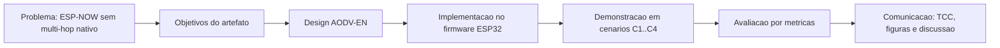
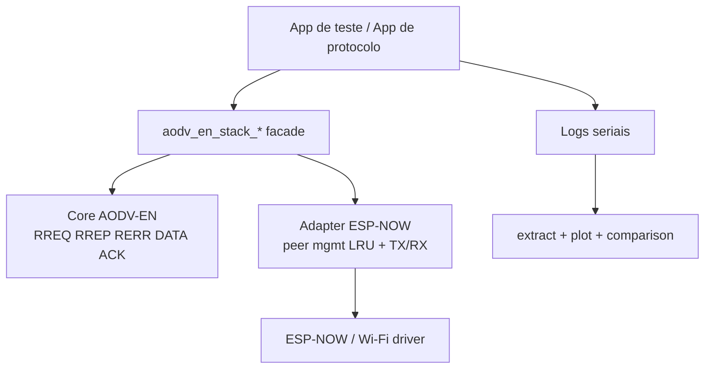
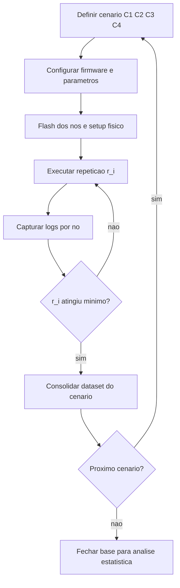
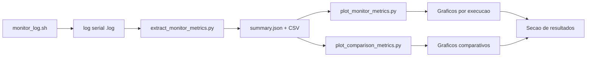
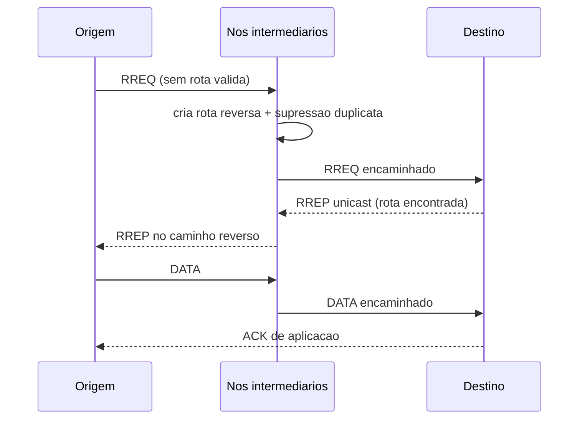
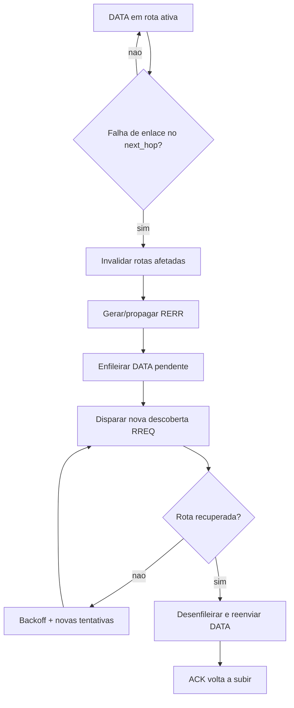
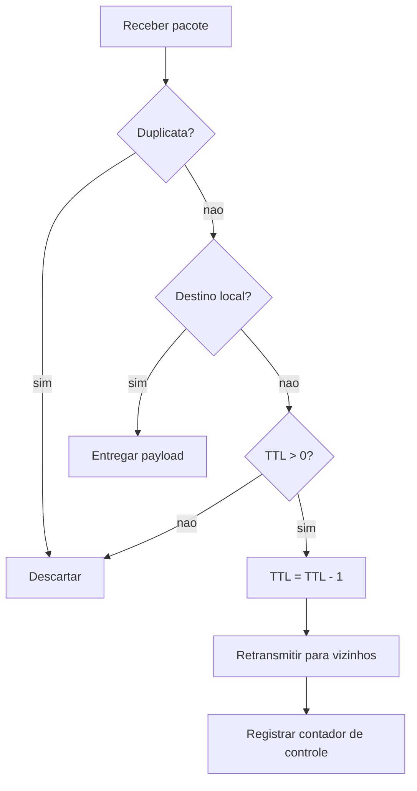
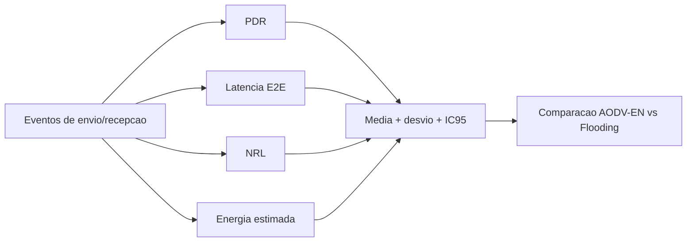
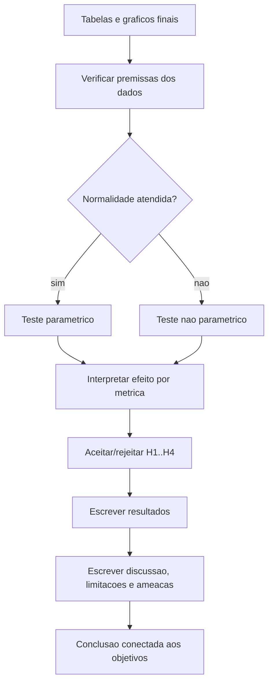

# Fluxos para Escrita do TCC - AODV-EN

Este documento consolida os fluxos principais para uso direto no TCC.
Os diagramas estao em Mermaid para facilitar manutencao e exportacao.

## Como usar no TCC

- Capitulo 4 (Metodologia): usar os fluxos F1, F3, F4, F8.
- Capitulo 5 (Implementacao): usar os fluxos F2, F5, F6, F7.
- Capitulo 6 (Resultados e Discussao): usar os fluxos F4, F8, F9.

## F1 - Encadeamento metodologico (DSR)

## F2 - Arquitetura do artefato implementado

## F3 - Fluxo da campanha experimental (cenarios e repeticoes)

## F4 - Pipeline de coleta, extracao e graficos

## F5 - Fluxo nominal de descoberta e entrega (AODV-EN)

## F6 - Fluxo de falha e reconvergencia

## F7 - Fluxo do baseline Flooding (planejado para comparacao)

## F8 - Fluxo de calculo das metricas

## F9 - Fluxo de analise estatistica e escrita

