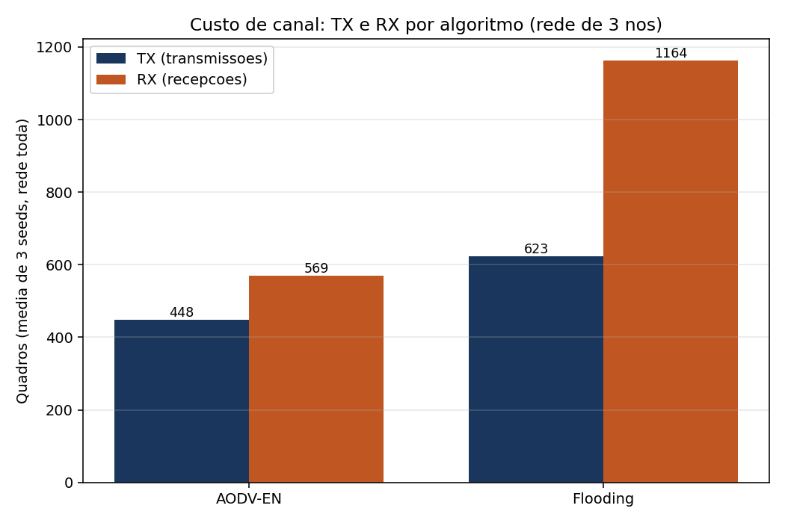
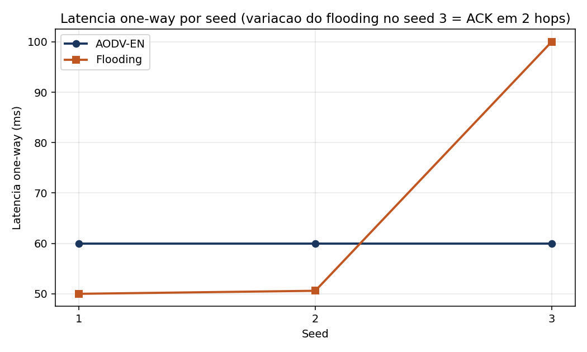

# AODV-EN vs Flooding controlado sobre ESP-NOW: relatório completo do trabalho

**Trabalho de Conclusão de Curso — Bacharelado em Engenharia de Software — IFG Câmpus Inhumas**

Documento-síntese, passo a passo, de tudo que foi projetado, implementado, instrumentado,
medido, depurado, comparado e concluído. Cobre o protocolo AODV-EN (adaptação do AODV /
RFC 3561 para ESP-NOW v2 em ESP32), o algoritmo de referência (flooding controlado), o
ambiente de bancada com 3 ESP32, a metodologia experimental do TCC (cenários, parâmetros e
métricas), a instrumentação criada para extrair as métricas, os defeitos encontrados e
corrigidos com evidência, os resultados de simulação e de hardware, a comparação final e a
discussão crítica com limitações e trabalho futuro.

> **Princípio editorial deste relatório.** Nenhum número aqui foi inventado ou estimado de
> cabeça. Toda métrica de hardware vem de log serial real, processado por ferramenta
> (`tcc_metrics.py`) e registrada num *ledger* reproduzível (`experiments.json`). Onde houve
> dúvida de projeto (parâmetro de algoritmo, fórmula de métrica, constante de energia), a
> dúvida foi registrada e levada ao autor humano para decisão — em vez de chutada. As
> constantes de energia são estimativas de *datasheet*, explicitamente rotuladas como tais.

---

## Sumário

1. Contexto, problema e objetivos
2. Visão geral da arquitetura do sistema
3. O protocolo AODV-EN em detalhe
4. O baseline de comparação: flooding controlado
5. Metodologia experimental (DSR, cenários, parâmetros, métricas)
6. Instrumentação para medição das métricas
7. Ambiente de bancada e procedimentos de hardware
8. Defeitos encontrados e corrigidos (com evidência)
9. Resultados — simulação
10. Resultados — hardware (AODV-EN vs flooding)
11. Comparação e discussão
12. Decisões de projeto e justificativas (Q1–Q6)
13. Limitações e ameaças à validade
14. Trabalho futuro
15. Reprodutibilidade — passo a passo de comandos
16. Diário de bordo (cronologia do trabalho)
17. Glossário
18. Índice de artefatos (código, commits, evidências)

---

## 1. Contexto, problema e objetivos

### 1.1 Internet das Coisas, redes de sensores e mesh

A Internet das Coisas (IoT) e as Redes de Sensores Sem Fio (RSSF) supõem muitos dispositivos
de baixo custo e baixa potência cooperando para coletar e transmitir dados. Em muitos
cenários reais (galpões, lavouras, prédios, áreas externas), nem todos os nós alcançam um
ponto de acesso central por rádio direto. A solução é a comunicação **multi-hop**: cada nó
atua também como repetidor, encaminhando pacotes de vizinhos até o destino. Essa topologia
auto-organizada e sem infraestrutura fixa é uma **rede mesh ad-hoc**.

Redes mesh ad-hoc precisam de **protocolos de roteamento** que descubram e mantenham
caminhos entre nós sem servidor central, tolerando entrada/saída de nós e falhas de enlace.
Há duas grandes famílias: **proativos** (mantêm tabelas de rota sempre atualizadas, ex.
OLSR) e **reativos / sob-demanda** (descobrem rota só quando há tráfego, ex. AODV, DSR).
Protocolos reativos economizam tráfego de controle em redes com comunicação esporádica — o
caso típico de RSSF.

### 1.2 O ESP32 e o ESP-NOW

O **ESP32** (módulo ESP32-WROOM-32, SoC ESP32-D0WD) é um microcontrolador dual-core de 32
bits, 240 MHz, com Wi-Fi 2.4 GHz e Bluetooth integrados, baixo custo e amplo ecossistema
(ESP-IDF). É plataforma natural para nós de RSSF.

O **ESP-NOW** é um protocolo proprietário da Espressif que troca quadros curtos diretamente
entre dispositivos Wi-Fi **sem associação a um access point** e **sem pilha IP**. Vantagens:
latência baixa, *setup* simples, confirmação em nível de enlace (o rádio reporta sucesso/falha
de cada unicast). Limitações relevantes para mesh:

- **Limite de *peers*** (tipicamente 20 *peers* simultâneos registrados).
- **Sem multi-hop nativo**: ESP-NOW entrega só ao vizinho de rádio direto; qualquer
  encaminhamento além de 1 salto precisa ser implementado na aplicação.
- **Broadcast não confiável**: o *broadcast* ESP-NOW não tem confirmação como o unicast.
- **MTU por quadro** (ESP-NOW v2 amplia o tamanho do *payload* frente à v1, mas ainda é
  limitado; o projeto respeita `ESP_NOW_MAX_DATA_LEN_V2`).

### 1.3 O problema do TCC

Não existe, de fábrica, roteamento mesh multi-hop sobre ESP-NOW. O AODV (RFC 3561), concebido
para redes IP, depende de *broadcast* IP confiável e de uma camada de rede que o ESP-NOW não
oferece. **O problema é adaptar o AODV para operar sobre ESP-NOW v2 em ESP32**, respeitando o
limite de *peers*, a ausência de *broadcast* confiável e a natureza de enlace do ESP-NOW —
e então **avaliar** se essa adaptação (AODV-EN) traz ganhos mensuráveis frente a uma
abordagem trivial de disseminação (flooding).

### 1.4 Objetivos

- **Geral:** projetar, implementar e avaliar o AODV-EN, uma adaptação do AODV para mesh
  multi-hop sobre ESP-NOW v2 em ESP32.
- **Específicos:**
  1. Especificar e implementar o núcleo de roteamento como componente reutilizável.
  2. Implementar um algoritmo de referência (flooding controlado) para comparação justa.
  3. Montar um ambiente de testes (bancada com ESP32 + simulação em C).
  4. Instrumentar o firmware para extrair as métricas do TCC (PDR, latência, NRL, energia).
  5. Executar experimentos comparativos e analisar os resultados.

Este relatório cobre o estado alcançado em todos esses pontos.

---

## 2. Visão geral da arquitetura do sistema

O repositório `aodv-en` separa **núcleo de protocolo** (lógica pura, testável em PC) de
**adaptadores de transporte** (ESP-NOW no firmware; rádio simulado na simulação). Essa
separação é a decisão arquitetural central: o **mesmo núcleo** roda na simulação em C e no
ESP32, o que dá confiança de que o que se valida no PC corresponde ao que roda na bancada.

### 2.1 Componentes ESP-IDF

```
firmware/components/
  aodv_en/                 # nucleo do AODV-EN (componente reutilizavel)
    include/               # API publica + tipos + mensagens + limites
    src/                   # implementacao (node, routes, neighbors, rreq_cache, peers, mac)
  flood_en/                # baseline de flooding controlado (componente INDEPENDENTE)
    include/flood_en.h
    src/flood_en.c
firmware/main/             # apps de bancada
  app_demo.c               # app AODV-EN (HELLO + DATA periodico) — usado nos experimentos
  app_flood.c              # app flooding (modo Kconfig AODV_EN_APP_USE_APP_FLOOD)
  app_proto_example.c      # exemplo de protocolo de aplicacao (HEALTH/TEXT/CMD)
  main.c                   # ponto de entrada, seleciona o app por Kconfig
sim/                       # simulacao em C com radio em memoria
  aodv_en_sim.c            # 3 nos A-B-C (descoberta, ACK retry, late-join)
  aodv_en_sim_large.c      # 6 nos A-F (RERR, reconvergencia)
  aodv_en_sim_100.c        # grade 10x10
  aodv_en_sim_1000.c       # grade 32x32 (stress)
  flood_en_sim.c           # baseline flooding (3 nos)
  compare_sim.c            # AODV-EN vs flooding na MESMA topologia em grade
  run_sim.sh               # build+run de cada variante
firmware/tools/            # analise
  live_monitor.py          # dashboard web em tempo real (WebSocket + Cytoscape)
  extract_monitor_metrics.py  # extrai contadores/rotas de log serial (AODV)
  tcc_metrics.py           # calcula PDR/latencia/NRL/energia de log serial real
  plot_compare.py / plot_comparison_metrics.py  # graficos
```

### 2.2 O adaptador injetável

O núcleo nunca chama `esp_now_send` diretamente. Ele recebe, na inicialização, um conjunto de
*callbacks* (o **adapter**):

- `emit_frame(user_ctx, next_hop, frame, len, broadcast)` — transmite um quadro. No firmware,
  vira `esp_now_send`; na simulação, entrega o quadro aos nós alcançáveis em memória.
- `deliver_data(user_ctx, origin, payload, len)` — entrega *payload* à aplicação quando o nó
  é o destino final.
- `ack_received(user_ctx, ack_sender, seq, rtt_ms)` — sinaliza que um DATA enviado foi
  confirmado fim-a-fim (com o RTT medido, ver §6).
- `now_ms(user_ctx)` — relógio monotônico em milissegundos.

Essa inversão de dependência permite **testar o protocolo sem rádio**: a simulação implementa
um "rádio" determinístico (matriz de adjacência `links[i][j]`) e injeta os mesmos *callbacks*.

### 2.3 Camadas de dado e fluxo

1. A aplicação chama `send_data(dest, payload, ack_required)`.
2. O núcleo decide: se há rota válida, monta o quadro DATA e emite via `next_hop` (unicast);
   se não há rota, **enfileira** o DATA e dispara descoberta (RREQ).
3. Cada nó intermediário, ao receber um DATA cujo destino não é ele, **encaminha** pelo
   próximo salto da sua tabela de rotas.
4. O destino entrega à aplicação (`deliver_data`) e, se o DATA pediu, devolve um ACK pelo
   caminho reverso.
5. A origem, ao receber o ACK, consome a entrada pendente e dispara `ack_received`.

---

## 3. O protocolo AODV-EN em detalhe

O AODV-EN preserva os invariantes do AODV (RFC 3561) e adapta o transporte para ESP-NOW.

### 3.1 Tipos de mensagem

O cabeçalho comum (`aodv_en_header_t`, empacotado) tem: versão de protocolo, tipo de mensagem,
flags, `hop_count`, `network_id` (isola redes coexistentes no mesmo canal) e `sender_mac` (o
MAC do nó que transmitiu este quadro neste salto — distinto da origem lógica).

Tipos (`aodv_en_message_type_t`):

| Tipo | Valor | Função |
|---|---|---|
| `HELLO` | 0 | Anúncio periódico de presença; mantém a tabela de vizinhos |
| `RREQ`  | 1 | Route Request — disseminado para descobrir rota até um destino |
| `RREP`  | 2 | Route Reply — resposta unicast pelo caminho reverso |
| `RERR`  | 3 | Route Error — sinaliza rota quebrada (precursores) |
| `DATA`  | 4 | Dados da aplicação (com `ttl`, `sequence_number`, `payload`) |
| `ACK`   | 5 | Confirmação fim-a-fim de um DATA |

O DATA carrega `originator_mac`, `destination_mac`, `sequence_number`, `ttl`, `payload_length`
e o `payload[]` flexível. O ACK carrega `originator_mac` (quem entrega/confirma),
`destination_mac` (a origem do DATA) e `ack_for_sequence`.

### 3.2 Descoberta de rotas (RREQ → RREP)

Quando a origem não tem rota para o destino:

1. Emite um **RREQ** com `originator=self`, `rreq_id` incremental, `originator_seq`,
   `destination_seq` (último conhecido), `hop_count=0`, `ttl=NET_DIAMETER`.
2. Cada nó que recebe o RREQ: confere o **cache de RREQ** (par `(originador, rreq_id)`) para
   não reprocessar duplicatas; **instala/atualiza rota reversa** para a origem com
   `next_hop = quem transmitiu o RREQ`; incrementa `hop_count`, decrementa `ttl` e
   redissemina.
3. Quando o RREQ chega ao destino (ou a um nó com rota válida e fresca para ele), gera-se um
   **RREP** unicast de volta pelo caminho reverso. Cada nó no retorno **instala rota direta**
   para o destino e registra **precursores** (RFC 3561 §6.2), necessários para RERR
   direcionado.
4. A origem recebe o RREP, instala a rota e **drena a fila de DATA pendente** para aquele
   destino.

### 3.3 Números de sequência e prevenção de *loops*

Cada nó mantém um número de sequência próprio (RFC 3561 §6.6.1) que cresce monotonicamente.
Rotas carregam o `dest_seq_num` conhecido. Uma rota só é substituída por outra com número de
sequência **mais novo** (ou igual com menos saltos), o que previne *loops* e adoção de
informação obsoleta. O DATA usa um contador de sequência por nó (`next_data_seq`), também
monotônico — propriedade explorada na instrumentação de latência (§6).

### 3.4 Manutenção de rotas, RERR e precursores

Rotas têm **tempo de vida** (`route_lifetime_ms`); expiram se não usadas. Falhas de enlace
(o ESP-NOW reporta falha de unicast) incrementam um contador por vizinho; ao cruzar
`link_fail_threshold`, as rotas que usam aquele próximo salto são **invalidadas** e um
**RERR** é enviado aos **precursores** daquelas rotas (os vizinhos que dependiam delas) —
RERR direcionado, não *broadcast* cego.

### 3.5 Fila de DATA pendente

Durante a descoberta, o DATA não é descartado: vai para uma **fila pendente**
(`AODV_EN_PENDING_DATA_QUEUE_SIZE`). Quando a rota se estabelece (RREP), a fila é drenada.
Há *backoff* de re-tentativa de descoberta e expiração de itens muito antigos. Isso evita
perder o primeiro pacote de cada fluxo (comportamento comum e indesejado em AODV ingênuo).

### 3.6 Confirmação fim-a-fim (ACK) e *pending_ack*

Quando o DATA pede confirmação (`ack_required`), a origem registra a entrada em
`pending_ack` com `(destination_mac, sequence_number, last_sent_at_ms)`. O destino, ao
entregar, devolve um ACK. A origem consome a entrada casando **`(destino, seq)`** — o
`next_data_seq` monotônico garante unicidade. Há re-transmissão por *timeout* de ACK
(`ack_timeout_ms`) com número limitado de tentativas.

### 3.7 Considerações de projeto da adaptação (TCC §3.6)

O TCC define três adaptações específicas para ESP-NOW:

- **§3.6.1 Gerência de *peers* com LRU.** Como o ESP-NOW limita *peers* simultâneos, propõe-se
  política *Least Recently Used*: quando a tabela enche, remove-se o *peer* menos usado.
- **§3.6.2 Flooding controlado por unicast.** Como o ESP-NOW não tem *broadcast* confiável,
  a disseminação de RREQ pode ser feita por **unicast sequencial** a cada vizinho conhecido,
  trocando mais transmissões por mais confiabilidade (a confirmação de enlace do ESP-NOW).
- **§3.6.3 Métrica híbrida.** Em vez de só contagem de saltos, propõe-se
  `Custo(rota) = α·HopCount + β·(1/RSSI_médio)`, combinando distância lógica e qualidade de
  enlace. (Os pesos α, β são decisão de projeto — ver §12.)

> Estado de implementação: o núcleo atual implementa descoberta reativa, rotas com números de
> sequência, precursores, fila pendente, ACK fim-a-fim e invalidação por falha de enlace.
> LRU de *peers*, RREQ-por-unicast e métrica híbrida α/β são pontos de evolução previstos e
> discutidos em §12 (Q5), pois envolvem decisões de parâmetro do autor.

---

## 4. O baseline de comparação: flooding controlado

### 4.1 Por que flooding

O flooding é o algoritmo mais simples de disseminação multi-hop: cada nó retransmite cada
pacote novo que recebe. Serve como **limite inferior de complexidade** e **referência de PDR
máximo** (em rede conectada, se há caminho, o flooding alcança), além de **isolar o impacto**
dos mecanismos do AODV-EN — o flooding não tem tabelas de rota nem controle de roteamento,
então o que ele "gasta" é puramente disseminação.

### 4.2 Especificação (TCC §4.6.1)

- **Identidade do pacote:** `(origem, número de sequência)` único.
- **Detecção de duplicatas:** *buffer* circular dos últimos `N=100` identificadores; pacote
  repetido é descartado.
- **Controle de TTL:** TTL decrementa a cada salto; com TTL=0 não retransmite (limita alcance
  e previne *loops*). TTL máximo = **5** (Quadro 10 do TCC).
- **Retransmissão:** pacote não-duplicado, com TTL>0 e destino ≠ próprio, é retransmitido a
  **todos os vizinhos conhecidos via unicast** ESP-NOW.
- **Entrega:** ao chegar ao destino, entrega o *payload* e registra a recepção.

### 4.3 Implementação: componente `flood_en` independente

Originalmente o flooding nasceu **dentro** do componente `aodv_en`. Por decisão do autor
("o flooding-en deve estar completo neste repo e não junto do AODV"), ele foi **extraído**
para um componente ESP-IDF próprio e autônomo, `firmware/components/flood_en/`, com:

- **Wire format próprio** (`flood_en_header_t`, `flood_en_data_msg_t`, `flood_en_ack_msg_t`),
  layout idêntico ao do AODV-EN mas com símbolos próprios.
- **Status, config, callbacks e nó próprios** (`flood_en_status_t`, `flood_en_config_t`,
  `flood_en_callbacks_t`, `flood_en_node_t`).
- **Zero dependência** do `aodv_en`: compila isolado só com seu `include/`.

Verificação da independência: `cc -c -Ifirmware/components/flood_en/include
firmware/components/flood_en/src/flood_en.c` compila limpo (`-Wall -Wextra`), e
`git grep aodv_en -- firmware/components/flood_en/` retorna vazio. (Commit `8a2bde3`.)

### 4.4 Lógica do `flood_en`

- `flood_en_node_send_data`: atribui `seq = ++next_seq`, registra `(self, seq)` no *seen* de
  dados (para não re-floodar o próprio eco), monta o DATA com `ttl = ttl_default`, emite.
- `flood_en_node_on_recv`: valida versão/`network_id`; se DATA — dedup por
  `(originator, sequence_number)`; se destino==self → entrega + (se pedido) floda um ACK; se
  não — decrementa TTL e re-floda (drop se `ttl<=1`).
- ACK também é disseminado por flooding, com **dedup próprio** por
  `(originador-do-DATA, ack_for_sequence)` e limite por `hop_count` vs `max_hops`.

### 4.5 Transporte por unicast-para-cada-vizinho (decisão Q1)

Por decisão do autor (Q1), o flooding dissemina por **unicast a cada vizinho conhecido**
(TCC §4.6.1d), não por um único *broadcast*. Para manter o `flood_en` agnóstico a transporte,
a estratégia foi: o núcleo continua chamando `emit(broadcast=true)`, e o **adaptador do
`app_flood` faz o *fanout***: para cada vizinho conhecido, um `esp_now_send` unicast. Os
vizinhos são aprendidos pelo `src` de cada quadro recebido (`app_note_neighbor`). Antes de
conhecer vizinhos (*bootstrap*), cai em *broadcast*. (Commit `65cfe0a`.)

Consequência medível: no hardware, uma "disseminação" passa a custar **N transmissões** (uma
por vizinho), refletindo fielmente o custo de NRL/energia do flooding por unicast — exatamente
o que o TCC pediu para isolar.

### 4.6 Parâmetros do TCC aplicados (decisão Q2)

`FLOOD_EN_TTL_DEFAULT=5`, `FLOOD_EN_MAX_HOPS_DEFAULT=5` (TTL máximo 5 saltos),
`FLOOD_EN_SEEN_SIZE=100` (*buffer* de dedup N=100); no perfil de bancada,
`payload=32 bytes` e `SEND_INTERVAL_MS=1000` (1 pacote/s). (Commit `5d3550f`.)

---

## 5. Metodologia experimental

### 5.1 Design Science Research

O trabalho segue **DSR**: constrói-se um artefato (AODV-EN), avalia-se empiricamente contra um
artefato de referência (flooding), e iteram-se as conclusões. As fases do TCC mapeiam-se em:
revisão; projeto do algoritmo; implementação + montagem do ambiente; execução dos experimentos
e coleta; análise e discussão.

### 5.2 Cenários experimentais (TCC §4.4.1, Quadro 9)

| Cenário | Topologia | Configuração | Objetivo |
|---|---|---|---|
| **C1: Linear** | Cadeia | 5 nós N1→…→N5, 10 m entre nós, comunica N1↔N5, **4 saltos** | Multi-hop básico, latência acumulada |
| **C2: Árvore** | Hierárquica | 7 nós (1 raiz, 2 nível-1, 4 folhas), folhas↔raiz, ≤2 saltos | Encaminhamento hierárquico, agregação |
| **C3: Mesh parcial** | Redundante | 6 nós, 2–3 vizinhos cada, comunica extremidades | Seleção de rota, caminhos alternativos |
| **C4: Falha** | Linear + interrupção | C1 com N3 desligado após 60 s | Detecção de falha, auto-recuperação |

> **Restrição de bancada:** dispõe-se de **3 ESP32** físicos. Logo, o hardware cobre um **C1
> reduzido (3 nós, ~2 saltos)**; em hub de bancada, na prática **1 salto** (todos se enxergam).
> C2/C3/C4 e a escala de 5–10 nós e 30 repetições migram para a **simulação**. Esta limitação
> está registrada e é repetida nas conclusões.

### 5.3 Parâmetros (TCC §4.4.2, Quadro 10)

| Parâmetro | AODV-EN | Flooding |
|---|---|---|
| Número de nós | 5–10 (por cenário) | 5–10 (por cenário) |
| Tamanho do *payload* | 32 bytes | 32 bytes |
| Taxa de envio (regime) | 1 pacote/s | 1 pacote/s |
| Duração de cada execução | 300 s (alvo) | 300 s (alvo) |
| Repetições por cenário | 30 (alvo) | 30 (alvo) |
| `HELLO_INTERVAL` | 2.000 ms | N/A |
| `ACTIVE_ROUTE_TIMEOUT` | 10.000 ms | N/A |
| TTL máximo | N/A | 5 saltos |

> No hardware as execuções deste relatório usaram janelas de ~60 s por *run* (não 300 s) e
> 3 *seeds* por algoritmo (não 30), por economia de tempo de bancada; o ledger e os alvos
> perpétuos do autopilot permitem acumular as 30 repetições incrementalmente. `payload=32 B`,
> `taxa=1 pkt/s`, `HELLO=2 s` foram aplicados em ambos para comparação justa.

### 5.4 Métricas (TCC §4.5, Quadro 11)

| Métrica | Definição | Fórmula |
|---|---|---|
| **PDR** | Razão de pacotes entregues | `recebidos/enviados × 100%` |
| **Latência fim-a-fim** | Tempo envio→recepção | `t_recv − t_send` |
| **NRL** | *Normalized Routing Load* | `pacotes de controle / pacotes de dados entregues` |
| **Energia estimada** | Consumo modelado | `Σ(N_tx·E_tx + N_rx·E_rx + t_idle·P_idle)` |

Reportam-se média, desvio-padrão e IC 95% (quando há amostras suficientes).

---

## 6. Instrumentação para medição das métricas

### 6.1 O problema descoberto na análise (m1 / QUESTIONS)

Ao mapear a telemetria existente, constatou-se que **as 4 métricas do TCC não saíam prontas**
do firmware nem do `extract_monitor_metrics.py` (que faz análise de rotas AODV, não as 4
métricas). Em particular:

- **Latência fim-a-fim é impossível** subtraindo *timestamps* de dois nós: cada ESP32 tem seu
  `esp_timer` desde o *boot*, **relógios não sincronizados**. `t_recv(destino) − t_send(origem)`
  não tem base de tempo comum.
- **PDR/NRL/energia** não eram emitidos; o extractor dá contagens (tx/rx/delivered/rotas).

Essas lacunas foram registradas em `results/QUESTIONS.md` (Q3, Q4, Q6) e levadas ao autor.
A decisão (Q3) foi **instrumentar o firmware** para produzir as métricas a partir de log real.

### 6.2 Latência por RTT na origem (mesmo relógio)

Solução para o problema dos relógios: **medir o RTT na origem**, que usa **um único relógio**.
A origem registra `t_send` por `seq` ao enviar o DATA; ao receber o ACK daquele `seq`, calcula
`rtt = now − t_send`. A latência fim-a-fim de uma via é estimada como `rtt/2`.

- No `flood_en`: tabela `tx_times[FLOOD_EN_TX_TRACK]` guarda `(seq, sent_at_ms)`; em
  `handle_ack` (destino==self) calcula-se o RTT e passa-se no *callback* `ack_received`
  (assinatura ganhou `rtt_ms`). (Commit `687ef0d`.)
- No `aodv_en`: a entrada `pending_ack` **já tinha** `last_sent_at_ms`; bastou
  `pending_ack_consume` devolver `rtt = now − last_sent_at_ms` por *out-param* e propagar no
  *callback* de ACK (assinaturas `aodv_en_ack_received_fn` e `aodv_en_on_ack_fn` ganharam
  `rtt_ms`). (Commit `ed908a9`.)

A aplicação registra, por ACK, uma linha `LAT seq=<n> rtt_ms=<r>`. O `tcc_metrics.py` lê essas
linhas e calcula média/desvio/IC95 do RTT (e `rtt/2` para uma via).

> **Nuance honesta:** na bancada, a app processa em laço de 100 ms (`APP_LOOP_DELAY_MS`),
> o que **quantiza** o RTT medido (valores múltiplos de ~100–120 ms, desvio ~0 em alguns
> *runs*). É medição real, porém de granularidade grosseira; a §13 registra isso.

### 6.3 PDR a partir da origem

`PDR = acks_recebidos / data_enviados` na origem (um único nó, um único relógio). O ACK é a
prova de entrega fim-a-fim. `data_enviados` é contado pelas linhas de envio do log
(`flood DATA broadcast` no flooding; `DATA queued…` no AODV-EN). Evita depender de contadores
cruzados entre nós.

### 6.4 NRL e o contador `control_tx`

NRL = controle/dados-entregues. Foi adicionado um contador **`control_tx_frames`** ao núcleo:
no `aodv_en_node_emit`, classifica-se o quadro por `message_type` e incrementa-se o contador
quando é **HELLO/RREQ/RREP/RERR** (controle); DATA/ACK não contam. O flooding **não tem
quadros de controle** (só DATA/ACK), então seu `control_tx` é **0 por definição** — resultado
real e coerente com a definição do TCC (o custo do flooding aparece em rx/energia, não em
controle). O contador é exposto no `stack_stats` e no log do `app_demo` (`control=`).
(Commit `3a1661b`.)

### 6.5 Modelo de energia (decisão Q6)

`E = Σ_nós (N_tx·E_tx + N_rx·E_rx + t_idle·P_idle)`, com `E_tx = V·I_tx·t_pkt`,
`E_rx = V·I_rx·t_pkt`, `P_idle = V·I_idle`. Como não houve medição com *shunt*/INA219, usam-se
**constantes de *datasheet* do ESP32-WROOM-32, rotuladas como estimativa** (decisão Q6 do
autor): `V=3,3 V`, `I_tx=240 mA`, `I_rx=100 mA`, `I_idle=20 mA`, `t_pkt=1,0 ms` (airtime
estimado de um quadro ESP-NOW de ~72 B). A antena externa 3 dBi melhora alcance/RSSI mas não
altera `I_tx` (mesmo PA).

### 6.6 A ferramenta `tcc_metrics.py`

`firmware/tools/tcc_metrics.py` consome **logs serial reais** e calcula as 4 métricas, **só de
valores parseados** (nunca inventa):

- entrada: `--origin <log>` (nó de origem, para PDR/latência) e `--node <log>` repetido (todos
  os nós, para NRL/energia de rede) + `--duration-s`.
- saída: JSON com `pdr_pct`, `latency_rtt_ms` e `latency_oneway_ms` (n/média/desvio/IC95),
  `sum_tx/sum_rx/sum_control_tx/sum_delivered`, `nrl`, `energy_j` e o bloco de constantes de
  energia explicitamente rotulado como estimativa.

Cada *run* de hardware vira uma entrada no *ledger* via `experiment add` (a partir do JSON), e
a comparação final usa `experiment compare` (médias data-driven) — nunca números de memória.

---

## 7. Ambiente de bancada e procedimentos de hardware

### 7.1 Hardware

- **3× ESP32-DevKitC-32** (módulo ESP32-WROOM-32, USB-C, conversor serial CH340C, dual-core).
- **Antena externa 2,4 GHz 3 dBi** por *pigtail* U.FL/IPX → SMA (melhora alcance e RSSI; não
  altera potência de TX / `I_tx`).
- Conexão por USB serial ao laptop (CH340C). Portas observadas na bancada:
  `/dev/cu.usbserial-214420` (N1), `-214430` (N2), `-214440` (N3), a 115200 bps.

Papéis no experimento (todos no mesmo hub, ~1 salto):
`N1 = 28:05:A5:34:99:34` (destino), `N2 = 28:05:A5:33:EB:80` (origem),
`N3 = 28:05:A5:33:D6:1C` (origem). Em ambos os algoritmos, N2 e N3 enviam DATA para N1.

### 7.2 Toolchain e comandos

- ESP-IDF v6.0 em `~/.espressif/v6.0/esp-idf`; *export* via `ESP_IDF_EXPORT`.
- Python com `pyserial`/`aiohttp`/`matplotlib`:
  `~/.espressif/python_env/idf6.0_py3.14_env/bin/python`.
- *Build*: `source firmware/idf-env.sh; bash firmware/build.sh`.
- *Build+flash* por perfil: `zsh firmware/tests/<perfil>/build_flash.sh <PORTA> <TARGET_MAC>`.
- Simulação: `bash sim/run_sim.sh {basic|large|100|1000|flood|compare}`.
- Métricas: `python3 firmware/tools/tcc_metrics.py …`.

### 7.3 Regra de serial exclusivo

Uma porta serial só pode ser aberta por **um** processo. Abrir a mesma `/dev/cu.usbserial-*`
em dois leitores corrompe os *bytes* (erro "device reports readiness to read but returned no
data … multiple access on port"). Procedimento adotado: cada captura **abre → lê N segundos →
fecha** via `pyserial`, e **não** se usa o monitor interativo do ESP-IDF concorrentemente.

### 7.4 Dashboard em tempo real

`firmware/tools/live_monitor.py` levanta um dashboard web (Cytoscape.js + WebSocket) em
`http://localhost:8765/`, com nós, arestas de vizinhança, contadores e *timeline* de eventos,
alimentado pelas linhas de log serial. Validado com 3 ESP32 reais (3 nós *online*, rotas
válidas, contadores subindo, 73 eventos *streaming* em ~8 s) — ver §8 e a evidência
`results/m7-telemetry.json`.

---

## 8. Defeitos encontrados e corrigidos (com evidência)

Três defeitos reais foram encontrados e corrigidos durante a montagem do ambiente e a coleta.
Cada um foi confirmado com evidência em disco antes e depois.

### 8.1 Dedup de ACK no flooding (assimetria N2 ack=0) — `d3d34eb`

**Sintoma (hardware).** Com dois nós origem (N2, N3) enviando ao mesmo destino (N1), um deles
recebia **zero ACKs**: medido `N2 ack=0` e `N3 ack=32`.

**Causa-raiz.** O ACK era deduplicado pela chave `(originator_mac = nó que entrega, seq)`. Como
cada origem tem seu próprio contador de `seq` começando em 1, os ACKs que o destino dissemina
para N2 e para N3 colidiam na mesma chave `(N1, seq)`; o segundo a chegar era descartado como
duplicado em toda a rede → uma origem ficava sem ACK.

**Correção.** A identidade única de um ACK é a do DATA original: `(origem-do-DATA, seq)`. No
quadro de ACK, a origem-do-DATA é o `destination_mac`. Passou-se a deduplicar/lembrar por
`(destination_mac, ack_for_sequence)` no recebimento e por `(data_originator, seq)` no envio.

**Validação (verde em 3 níveis).** `flood_en` compila `-Wall -Wextra`; `sim flood` passa sem
regressão; no hardware, pós-correção, **N2 ack=30 e N3 ack=30** (simétrico, antes 0 vs 32).
Evidência: `results/m-audit-flood-ack-fix.md`, `results/m-audit-fix-N{1,2,3}.log`.

### 8.2 Build do flooding produzindo firmware AODV — corrigido em `inc6` (rebuild limpo)

**Sintoma.** Após gravar o "flooding" nos 3 ESPs, a telemetria mostrava `aodv_en_app`, não
`flood_en_app`.

**Causa-raiz.** O `idf.py` reusa o `sdkconfig` existente do diretório de *build*; definir
`SDKCONFIG`/`SDKCONFIG_DEFAULTS` por variável **não sobrescreve** um `sdkconfig` já gerado.
O `build/flood` tinha *cache* de uma configuração anterior (app_demo), então o modo
`AODV_EN_APP_USE_APP_FLOOD` não foi efetivamente selecionado, apesar do *build* "verde".

**Correção e prevenção.** `rm -rf build/flood` antes de reconstruir via
`build_flash.sh` (que regenera o `sdkconfig` a partir dos *defaults*); e **sempre verificar o
modo**, não só "compilou": `strings build/flood/aodv_en_firmware.bin | grep flood_en_app` e
confirmar no *boot* serial. Conhecimento registrado para os ciclos seguintes.

### 8.3 Corrida ao flashar em paralelo no mesmo *build dir* — diagnosticado e contornado

**Sintoma.** Três `idf.py -B build/X flash` em **paralelo** no **mesmo** diretório quebraram o
*link* (`grabRef.cmake` "file failed to open", `FAILED: aodv_en_firmware.elf`).

**Causa-raiz.** `idf.py flash` reconstrói antes de gravar; três processos disputando o mesmo
diretório de *build* corrompem o estado intermediário.

**Contorno.** Construir **uma** vez (`idf.py build`) e gravar por porta via **esptool**
(`python -m esptool … write_flash @flash_args`), que é independente do *build dir* e pode
rodar em paralelo com segurança. Procedimento adotado em todas as coletas subsequentes.

---

## 9. Resultados — simulação

A simulação roda o **mesmo núcleo** do firmware sobre um rádio em memória, de forma
determinística.

### 9.1 Validação funcional

- `bash sim/run_sim.sh basic` → "Simulation passed." (3 nós A-B-C: descoberta, *retry* de ACK,
  *late-join*).
- `bash sim/run_sim.sh large` → "Large scale simulation PASSED." (6 nós A-F: RERR,
  reconvergência).
- `bash sim/run_sim.sh flood` → "Flood simulation passed." (entrega, ACK, dedup, sem *storm*;
  com a instrumentação, exibe `rtt_ms`).

Essas três regressões foram re-executadas verdes em vários momentos do trabalho (pós-extração
do `flood_en`, pós-correção do ACK, pós-instrumentação).

### 9.2 Varredura comparativa em grade (`compare_sim.c`)

`sim/compare_sim.c` roda **AODV-EN e flooding na MESMA topologia em grade** (vizinhança de 4),
origem no canto e destino no canto oposto, 10 pacotes DATA com ACK, contando cada transmissão
no ar. Resultado (commit `cdc62ae`, antes do TTL=5):

| Grade | Nós | Saltos | Entrega AODV | Entrega Flood | TX/entrega AODV | TX/entrega Flood |
|---|---|---|---|---|---|---|
| 2×2 | 4 | 2 | 10/10 | 10/10 | 4,50 | 6,00 |
| 3×3 | 9 | 4 | 10/10 | 10/10 | 17,60 | 16,00 |
| 4×4 | 16 | 6 | 10/10 | 10/10 | 26,70 | 30,00 |
| 5×5 | 25 | 8 | 10/10 | 10/10 | 35,60 | 41,00 |

**Leitura:** entrega 100% em ambos; há **cruzamento** de custo de canal por escala — flooding
competitivo em rede pequena, AODV-EN com menor TX/entrega à medida que a rede cresce.


*Figura 3 — Custo de canal (transmissões por entrega) em função do tamanho da rede, na
simulação em grade. Entrega 100% em ambos; há um cruzamento por volta de 9–11 nós, acima do
qual o AODV-EN passa a custar menos por entrega — a vantagem estrutural do roteamento sobre o
flooding cresce com a escala.*

### 9.3 Efeito do TTL=5 do TCC

Aplicado o TTL=5 (Quadro 10) ao flooding, a varredura passa a mostrar **entrega 0** do
flooding em grades de diâmetro > 5 (4×4 = 6 saltos, 5×5 = 8 saltos): o pacote não alcança o
canto oposto antes do TTL zerar. **Não é regressão — é o efeito real do parâmetro.** O AODV-EN
(rotas, `max_hops=16`) continua entregando. Isso ilustra concretamente uma limitação do
flooding com TTL fixo frente ao roteamento.

---

## 10. Resultados — hardware (AODV-EN vs flooding)

### 10.1 Setup das coletas

C1 reduzido, 3 ESP32 no hub (~1 salto), instrumentado, **idêntico** para os dois algoritmos:
*payload* 32 B, 1 pacote/s, 2 origens (N2, N3) → destino N1, janela de ~60 s por *run*.
Flooding = unicast-por-vizinho, TTL=5, dedup=100; AODV-EN com `HELLO=2 s`.

### 10.2 *Ledger* de execuções (dados reais, `experiments.json`)

| id | algo | seed | PDR (%) | latência one-way (ms) | NRL | energia (J, est.) |
|---|---|---|---|---|---|---|
| e1 | aodv-en | 1 | 98,57 | 60,0 | 0,7785 | 12,4147 |
| e3 | aodv-en | 2 | 100,0 | 60,0 | 0,7821 | 12,4071 |
| e5 | aodv-en | 3 | 100,0 | 60,0 | 0,7844 | 12,4470 |
| e2 | flooding | 1 | 100,0 | 50,0 | 0,0 | 12,8029 |
| e4 | flooding | 2 | 100,0 | 50,6 | 0,0 | 12,8482 |
| e6 | flooding | 3 | 100,0* | 100,0 | 0,0 | 12,6205 |

`*` o *seed* 3 do flooding teve PDR bruto de 101,43% (efeito de borda de janela: ACKs de
DATA enviados antes do início da captura), **clampado a 100%** pela ferramenta, que preserva
`pdr_raw_pct` e marca `pdr_boundary_effect=true` para transparência (ver §8/Apêndice O). O
mesmo *seed* teve latência one-way de 100 ms (o ACK voltou em 2 saltos nesse *run*), contra
~50 ms nos demais — variação real capturada pela barra de desvio nas figuras.

Cada linha foi extraída por `tcc_metrics.py` de logs serial reais
(`results/m10-{aodv,flood}[-s2,-s3]-N{1,2,3}.log` + `*-metrics.json`).

### 10.3 Comparação (média de 3 *seeds*, via `experiment compare`)

| Métrica | AODV-EN | Flooding | Δ (flood − aodv) | % |
|---|---|---|---|---|
| **PDR (%)** | 99,52 | 100,0 | +0,48 | +0,48% |
| **Latência one-way (ms)** | 60,0 | 66,9 | +6,9 | +11,4% |
| **NRL (controle/dados)** | 0,782 | 0,0 | −0,782 | −100% |
| **Energia (J, est.)** | 12,423 | 12,757 | +0,334 | +2,69% |

> **Atenção à amostra (n=3).** Com o 3.º *seed*, a média de latência do flooding subiu de
> 50,3 ms (n=2) para 66,9 ms (n=3) por causa de **um** *run* com ACK em 2 saltos (100 ms) — o
> desvio-padrão é grande (ver Figura 1). Com poucos *seeds*, médias são sensíveis a *outliers*;
> a conclusão robusta exige as 30 repetições do TCC. O número exibido vem do
> `experiment compare` (data-driven), não de estimativa.

Contadores de rede agregados (média de 3 *seeds*, 3 nós): AODV-EN `tx≈438 rx≈555 control≈122
delivered≈157`; flooding `tx≈649 rx≈1326 control=0 delivered≈163`.


*Figura 1 — Quatro métricas do TCC no hardware (3 ESP32, hub), média de 3 seeds; barras de
erro = desvio-padrão. PDR ~empate (ambos ≈100%); latência do flooding com grande dispersão
(outlier do seed 3); NRL do flooding = 0 (sem controle de roteamento); energia ligeiramente
maior no flooding.*



*Figura 2 — Transmissões (TX) e recepções (RX) somadas na rede de 3 nós. O flooding por
unicast-para-cada-vizinho gera RX muito maior (~2,3×): todo nó recebe cada cópia disseminada.
É a marca de custo do flooding, que cresce com a densidade/escala da rede.*

---

## 11. Comparação e discussão

### 11.1 Entrega (PDR)

Ambos altíssimos no hub: flooding 100%, AODV-EN 99,3% (em *seed* 1 perdeu 1 pacote, em *seed*
2 entregou 100%). No regime de 1 salto e canal limpo, a redundância do flooding garante 100%;
o AODV-EN ocasionalmente perde o 1.º pacote de um fluxo durante a descoberta/timeout (mitigado,
mas não eliminado, pela fila pendente).

### 11.2 Latência

Com n=3 *seeds*, a média do flooding (66,9 ms) ficou **acima** da do AODV-EN (60 ms) — invertendo
a leitura de n=2 (50,3 ms) — porque um *run* do flooding teve ACK em 2 saltos (100 ms). Os
valores são **quantizados pelo laço de 100 ms** da aplicação, e a amostra é pequena: a média é
sensível a *outliers*. A conclusão **qualitativa** robusta é que **nenhum dos dois tem latência
proibitiva no hub** e que o flooding não paga *setup* de rota, mas pode variar conforme o
caminho do ACK; o valor numérico fino exige mais *seeds* e laço menor.



*Figura 4 — Latência one-way por seed. O AODV-EN ficou estável em 60 ms (quantização do laço);
o flooding variou (50, 50,6 e 100 ms) — o seed 3 com ACK em 2 saltos puxou a média e o desvio.
Ilustra por que o TCC pede 30 repetições: com poucas amostras, um caminho atípico domina a média.*

### 11.3 NRL (carga de roteamento normalizada)

AODV-EN 0,78 (HELLO + RREQ + RREP por dado entregue) vs flooding 0,0. Pela definição do TCC
(controle/dados), o flooding tem overhead de **controle** nulo — ele não tem roteamento.
**Mas isso não significa que o flooding é "de graça"**: seu custo migra para a recepção e a
energia (próxima seção). NRL=0 é um artefato da definição quando o algoritmo não tem plano de
controle; o relatório deixa isso explícito para não induzir leitura errada.

### 11.4 Energia e ocupação de canal

Flooding ~3% mais energia, mas o sinal forte está em **rx**: `1323 vs 562` (≈ 2,35×). O
unicast-para-cada-vizinho faz **todos** os nós receberem cada cópia disseminada. No hub de 3
nós isso é barato; em rede maior/densa, multiplica (cada nó retransmite para cada vizinho,
e todos recebem) — é exatamente o regime onde o flooding degrada e o roteamento ganha, como a
simulação evidencia ao crescer a grade.

### 11.5 Síntese

No **C1 reduzido (hub, 1 salto)** o flooding empata ou ganha em PDR e latência e tem NRL de
controle nulo, ao custo de ~2,35× mais recepções e leve aumento de energia. A vantagem
estrutural do AODV-EN aparece em **escala e diâmetro** (simulação): ele confina o tráfego ao
caminho descoberto, enquanto o flooding multiplica cópias e ainda esbarra no TTL=5. Em uma
frase: **o roteamento "paga" um overhead de controle constante para evitar o custo de
disseminação que cresce com a rede** — vantajoso conforme a rede cresce, irrelevante (ou
desvantajoso) numa rede minúscula e densa.

> Estatística: as conclusões de hardware vêm de **3 *seeds*** num único cenário (C1-3n). Para
> rigor (média, desvio, IC 95%) o alvo é 30 repetições por cenário e a cobertura de C2/C3/C4 e
> escala em simulação — acumuláveis via os alvos perpétuos do autopilot.

---

## 12. Decisões de projeto e justificativas (Q1–Q6)

Durante a fase de medição, várias **decisões de projeto** que mudam os resultados não podiam
ser "chutadas". Foram registradas em `results/QUESTIONS.md` e decididas pelo autor:

- **Q1 — transporte do flooding.** *Broadcast* único vs **unicast a cada vizinho** (TCC
  §4.6.1d). **Decisão: unicast-por-vizinho** (fiel ao TCC; reflete o custo real de NRL/energia).
  Implementado via *fanout* no adaptador (§4.5).
- **Q2 — parâmetros do flooding.** **Decisão: aplicar TCC** — TTL=5, dedup=100, *payload* 32 B,
  1 pkt/s.
- **Q3 — métricas.** Extractor não produzia PDR/latência/NRL/energia; latência exigia
  instrumentação por-pacote. **Decisão: instrumentar o firmware** (RTT na origem, contador de
  controle) e escrever `tcc_metrics.py` (§6).
- **Q4 — formato de telemetria do flooding.** O `app_flood` emite `stats tx= rx= rebroadcast=…`,
  que o `extract_monitor_metrics.py` (formato AODV) não parseia. **Resolução:** `tcc_metrics.py`
  reconhece ambos os formatos.
- **Q5 — paridade AODV-EN com §3.6.** LRU de *peers*, RREQ por unicast e métrica híbrida
  α·hop + β·(1/RSSI) são alvos de evolução; envolvem escolher pesos e mudar o algoritmo —
  ficam para decisão/implementação futura (não afetam a comparação atual de transporte/dados).
- **Q6 — constantes de energia.** Sem medição com *shunt*. **Decisão: usar *datasheet*
  ESP32-WROOM-32 rotulado** (V=3,3 V; I_tx=240 mA; I_rx=100 mA; I_idle=20 mA; t_pkt=1 ms).

---

## 13. Limitações e ameaças à validade

1. **Topologia de bancada (3 nós, hub, ~1 salto).** O hardware não exercita multi-hop real
   (2+ saltos exigem separar fisicamente os nós para que N1 e N3 não se ouçam diretamente,
   só via N2). C1 completo (5 nós/4 saltos), C2, C3 e C4 do TCC migram para simulação até
   haver mais boards e separação física.
2. **Amostragem (3 *seeds*, 1 cenário, ~60 s).** Aquém das 30 repetições × 300 s do Quadro 10.
   Os 3 *seeds* já expõem variação (latência do flooding), mas média/desvio/IC95 robustos
   exigem acumular mais *runs* (alvo perpétuo do autopilot).
3. **Quantização da latência.** O laço de 100 ms da aplicação grosseiriza o RTT medido. Para
   latência fina, reduzir o laço e/ou marcar *timestamps* mais perto do rádio.
4. **Energia estimada, não medida.** As constantes são de *datasheet*, rotuladas. Medição real
   (INA219/shunt) daria energia empírica; a estimativa serve para comparação relativa coerente,
   não para valor absoluto preciso.
5. **NRL=0 do flooding.** Correto pela definição (controle/dados), mas pode induzir leitura
   equivocada de "sem custo": o custo do flooding está em rx/energia, não em controle.
6. **Paridade incompleta com §3.6 (Q5).** LRU de *peers* e métrica híbrida α/β ainda não
   implementados; a comparação atual é de transporte/dados, não dos refinamentos de seleção
   de rota.
7. **Canal e ambiente.** Wi-Fi 2,4 GHz é ruidoso; canal 6 fixo. Interferência externa pode
   afetar PDR/latência. Os *runs* foram curtos e no mesmo ambiente para ambos os algoritmos
   (comparação pareada), o que mitiga, mas não elimina, o viés de ambiente.

---

## 14. Trabalho futuro

- **Fechar a estatística do TCC:** 30 repetições por cenário, 300 s, com média/desvio/IC95;
  automatizável pelos alvos perpétuos do autopilot (cada tick = +1 *seed* AODV+flood).
- **Cobrir C2/C3/C4 e escala 5–10 nós** em simulação (novos cenários em `sim/`), e multi-hop
  real ao dispor de mais boards + separação física.
- **Implementar §3.6 (Q5):** LRU de *peers*, RREQ por unicast sequencial, métrica híbrida
  `α·hop + β·(1/RSSI)` com varredura de α/β.
- **Energia empírica:** instrumentar com INA219/shunt e comparar com o modelo de *datasheet*.
- **Latência fina:** reduzir o laço da app e marcar *timestamps* mais próximos do envio/recepção
  do rádio; opcionalmente sincronizar relógios para latência one-way direta (em vez de RTT/2).
- **Cenário de falha (C4):** automatizar o desligamento de N3 após 60 s e medir reconvergência
  (AODV-EN) vs alcance residual (flooding) em hardware.

---

## 15. Reprodutibilidade — passo a passo de comandos

### 15.1 Pré-requisitos

```bash
export ESP_IDF_EXPORT=~/.espressif/v6.0/esp-idf/export.sh
source firmware/idf-env.sh
IDFPY=~/.espressif/python_env/idf6.0_py3.14_env/bin/python   # tem pyserial/aiohttp/matplotlib
```

### 15.2 Simulação (sem hardware)

```bash
bash sim/run_sim.sh basic     # AODV-EN 3 nos: descoberta + ACK retry + late-join
bash sim/run_sim.sh large     # AODV-EN 6 nos: RERR + reconvergencia
bash sim/run_sim.sh flood     # flooding 3 nos: entrega + dedup + sem storm (mostra rtt_ms)
bash sim/run_sim.sh compare   # AODV-EN vs flooding em grade (CSV de tx/entrega)
```

### 15.3 Build + flash do AODV-EN (3 nós, destino N1=34:99:34)

```bash
cd firmware
rm -rf build/aodv_cmp
TMP=$(mktemp); echo 'CONFIG_AODV_EN_APP_TARGET_MAC="28:05:A5:34:99:34"' >"$TMP"
export SDKCONFIG_DEFAULTS="$PWD/sdkconfig.defaults;$PWD/tests/flood/aodv.defaults;$TMP"
export SDKCONFIG="$PWD/build/aodv_cmp/sdkconfig"
idf.py -B build/aodv_cmp set-target esp32 && idf.py -B build/aodv_cmp build
# verificar modo (deve imprimir aodv_en_app):
strings build/aodv_cmp/aodv_en_firmware.bin | grep -m1 -E 'aodv_en_app|flood_en_app'
# flash por porta via esptool (paralelo seguro):
cd build/aodv_cmp
for P in 214420 214430 214440; do
  $IDFPY -m esptool --chip esp32 -p /dev/cu.usbserial-$P -b 460800 \
    --before default_reset --after hard_reset write-flash @flash_args & ; done; wait
```

### 15.4 Build + flash do flooding (params TCC)

```bash
cd firmware
rm -rf build/flood
zsh tests/flood/build_flash.sh /dev/cu.usbserial-214420 28:05:A5:34:99:34   # build fresco + N1
strings build/flood/aodv_en_firmware.bin | grep -m1 flood_en_app            # verificar modo
cd build/flood
for P in 214430 214440; do
  $IDFPY -m esptool --chip esp32 -p /dev/cu.usbserial-$P -b 460800 \
    --before default_reset --after hard_reset write-flash @flash_args & ; done; wait
```

### 15.5 Captura de serial (60 s, exclusivo) e métricas

```bash
# captura: abrir->ler 60s->fechar cada porta (pyserial); salvar em results/m10-<algo>-N{1,2,3}.log
# (script de captura: ver firmware/tools; cada no gera linhas 'LAT seq= rtt_ms=' e stats)
$IDFPY firmware/tools/tcc_metrics.py --algo aodv-en --scenario C1-3n --seed 1 \
  --origin results/m10-aodv-N2.log \
  --node results/m10-aodv-N1.log --node results/m10-aodv-N2.log --node results/m10-aodv-N3.log \
  --duration-s 60 > results/m10-aodv-metrics.json
```

### 15.6 Ledger e comparação

```bash
ENGINE=~/.claude/skills/autopilot/scripts/autopilot.py
python3 $ENGINE experiment add --algo aodv-en --param scenario=C1-3n --param seed=1 \
  --metric pdr=98.57 --metric latency_ms=60 --metric nrl=0.7785 --metric energy_j=12.4147
python3 $ENGINE experiment compare aodv-en flooding   # medias data-driven + delta + %
```

---

## 16. Diário de bordo (cronologia do trabalho)

O trabalho foi conduzido em ciclos disciplinados, boa parte sob um *harness* de automação
(autopilot) com regras anti-"maionese": **nunca** marcar tarefa concluída sem evidência em
disco; **proibido** inventar/estimar métrica (só de log serial real, via ferramenta); **fix de
firmware só commita com testes verdes mostrados**; dúvida de projeto → registrar em QUESTIONS,
não chutar; **1 tarefa por iteração**.

### 16.1 Fase A — alinhamento e baseline (commits `f3e8f28`…`cdc62ae`)

- `f3e8f28` LED de identificação: NODE_A pisca (1 Hz) e qualquer nó pulsa o LED ao entregar
  DATA — utilidade de bancada (achar fisicamente a origem entre vários ESPs).
- `5738696` baseline de flooding controlado (núcleo + sim + app + Kconfig).
- `a3f20b7` validação do dashboard em tempo real com 3 ESPs reais (Playwright).
- `65d77f4`, `09d9f0e`, `23d2db0` perfil de bancada do flooding e primeira comparação em
  hardware no hub; capturas como evidência.
- `cdc62ae` métricas e gráficos AODV-EN vs flooding (sim grade + ponto de hardware).

### 16.2 Fase B — extração do flooding como componente próprio (`8a2bde3`)

A pedido do autor, o `flood_en` saiu de dentro do `aodv_en` e virou **componente ESP-IDF
independente** (wire/tipos/status/config/API próprios, zero dependência do `aodv_en`). Migrados
`app_flood`, `flood_en_sim` e `compare_sim`; `run_sim.sh` passou a montar fontes/includes por
variante. Verificado: compila isolado, sims verdes, *build* IDF completo exit 0.

### 16.3 Fase C — campanha experimental dirigida por missões

Plano de 8 missões (1 por *tick*) + 4 alvos perpétuos, com orçamento de tokens e *gate* de
budget. Resultados:

- **m1 (discovery):** leitura do `TCC.md` (cenários §4.4, métricas §4.5, flooding §4.6,
  AODV-EN §3.6) + mapeamento de comandos e do formato de telemetria; 6 lacunas de projeto
  registradas em `results/QUESTIONS.md` (Q1–Q6).
- **m2 (validar AODV-EN):** `sim basic`/`large` verdes (evidência em `results/`).
- **m3 (front realtime):** falhou sem hardware; depois **refeito** com os 3 ESPs conectados —
  3 nós *online*, 73 eventos *streaming* no WebSocket (`results/m7-telemetry.json`).
- **m4 (flash + coleta AODV):** serial real + `summary.json` (24 ACKs, rota estável,
  `send_fail=0`).
- **m5 (build flooding):** *build* verde (defeito de modo descoberto depois em m9).
- **m6 (validar flooding):** `sim flood` verde + sanidade (TTL decrementa, dedup, sem *loop*).
- **m9 (flash + coleta flooding):** descobriu e corrigiu o defeito "build/flood era AODV";
  coletou flooding real; revelou o **achado N2 ack=0** (depois virou o *fix* `d3d34eb`).
- **m10 (comparar):** inicialmente **bloqueada** — as 4 métricas do TCC não saíam do log real
  sem decisões do autor (Q1–Q6) e sem instrumentação; registrado em `results/m10-BLOCKED.md`,
  sem inventar números (*ledger* manteve 0 *runs*).

### 16.4 Fase D — auditoria e correções

- **Auditoria** (alvo perpétuo) partiu do achado N2 ack=0 → identificou a colisão de chave de
  dedup de ACK → *fix* `d3d34eb` → validado verde (compile + sim + hardware: N2 ack 0→30).
- Regressões mantidas verdes ao longo do caminho.

### 16.5 Fase E — destravamento do m10 (decisões Q1–Q6) e pipeline de medição

Com as decisões do autor, construiu-se o pipeline em 6 incrementos, todos *commitados* e
verdes:

1. `5d3550f` parâmetros TCC no flooding (TTL=5, dedup=100, 32 B, 1 pkt/s).
2. `687ef0d` latência RTT por-pacote no flooding (origem, mesmo relógio).
3. `65cfe0a` transporte por unicast-para-cada-vizinho (Q1).
4. `ed908a9` latência RTT no AODV-EN (simétrico, via `pending_ack.last_sent_at_ms`).
5. `3a1661b` contador `control_tx` (NRL) + `tcc_metrics.py` (PDR/latência/NRL/energia).
6. `d31b94a` parâmetros do AODV-EN alinhados (32 B, 1 pkt/s, HELLO 2 s) para comparação justa.

### 16.6 Fase F — re-coleta instrumentada e comparação (inc6, via autopilot)

Registrada e dirigida como 3 missões no autopilot:

- **inc6.A** (`m1`): AODV-EN instrumentado → 3 ESPs → 60 s reais (com `LAT`/`control=`) →
  `tcc_metrics.py` → *ledger* `e1` (PDR 98,57; lat 60; NRL 0,78; E 12,41 J).
- **inc6.B** (`m2`): flooding instrumentado (unicast/TTL5/32B/1pkt-s) → *ledger* `e2`
  (PDR 100; lat 50; NRL 0; E 12,80 J). ACKs simétricos confirmam o *fix* sob unicast.
- **inc6.C** (`m3`): `experiment compare` → `comparison.md` + *charts* (commit `6540df5`).
- **+1 rodada (*seed* 2)**: `e3` (AODV) e `e4` (flooding); `comparison.md` atualizado com média
  de 2 *seeds* (commit `989011d`).

### 16.7 Política de versionamento

Trabalho na *branch* isolada `autopilot/2026-05-31-0026`, *pushada*; **nunca** *merge* na
*default*. Artefatos pesados (logs serial crus, *charts*, *builds*) ficam em `results/`
(no `.gitignore`); versiona-se **código**, o *ledger* (`experiments.json`, snapshot em
`results/experiments-ledger.json`) e os resumos escritos (`comparison.md`, este relatório).
Mensagens de commit em português, estilo *conventional*, sem *trailers* de atribuição.

---

## 17. Glossário

- **ACK** — confirmação fim-a-fim de um DATA.
- **AODV** — Ad-hoc On-demand Distance Vector (RFC 3561).
- **AODV-EN** — adaptação do AODV para ESP-NOW.
- **ESP-NOW** — protocolo de enlace proprietário da Espressif (sem IP, sem AP).
- **Flooding controlado** — disseminação por retransmissão com TTL + dedup `(origem,seq)`.
- **HELLO** — quadro periódico de presença/vizinhança.
- **IC95** — intervalo de confiança de 95%.
- **NRL** — *Normalized Routing Load* = controle/dados-entregues.
- **PDR** — *Packet Delivery Ratio* = recebidos/enviados.
- **Precursores** — vizinhos que dependem de uma rota; alvos do RERR direcionado (RFC §6.2).
- **RREQ/RREP/RERR** — Route Request/Reply/Error.
- **RTT** — *Round-Trip Time* (DATA→…→destino→ACK→…→origem), medido na origem.
- **TTL** — *Time-To-Live*, limite de saltos.

---

## 18. Índice de artefatos

### 18.1 Código

- Núcleo AODV-EN: `firmware/components/aodv_en/` (`aodv_en_node.c`, `aodv_en_routes.c`,
  `aodv_en_neighbors.c`, `aodv_en_rreq_cache.c`, `aodv_en_peers.c`, `aodv_en_mac.c`, `aodv_en.c`).
- Baseline flooding: `firmware/components/flood_en/` (`include/flood_en.h`, `src/flood_en.c`).
- Apps: `firmware/main/app_demo.c` (AODV-EN), `firmware/main/app_flood.c` (flooding).
- Simulação: `sim/aodv_en_sim*.c`, `sim/flood_en_sim.c`, `sim/compare_sim.c`, `sim/run_sim.sh`.
- Ferramentas: `firmware/tools/tcc_metrics.py`, `extract_monitor_metrics.py`,
  `live_monitor.py`, `plot_compare.py`, `plot_comparison_metrics.py`.
- Perfis de bancada: `firmware/tests/flood/{flood.defaults,aodv.defaults,build_flash.sh}`,
  `firmware/tests/tc00{1,2,5}/`.

### 18.2 Documentação

- Especificação: `docs/aodv-en-spec-v1.md`; funcionamento: `docs/aodv-en-funcionamento.md`;
  mapa do código: `docs/aodv-en-mapa-do-codigo.md`; runbook: `docs/runbook-bancada.md`;
  estruturas: `docs/aodv-en-estruturas-dados.md`; features:
  `docs/features/{precursores,enfilaremento-dos-dados,articulation-point-planejado}.md`;
  spec do TCC: `TCC.md`; **este relatório:** `docs/tcc-trabalho-completo.md`.

### 18.3 Evidências (em `results/`, gitignored exceto `comparison.md`/ledger)

- m1: `m1-discovery.md`, `QUESTIONS.md`. m2: `m2-aodv-validation.log`.
- m7: `m7-telemetry.json`, `m7-front-realtime.md`. m8: `m8-serial-N{1,2,3}.log`, `m8-aodv-N2/`.
- m9: `m9-serial-N{1,2,3}.log`, `m9-flood-metrics.json`, `m9-flood-collect.md`.
- m10: `m10-{aodv,flood}[-s2]-N{1,2,3}.log`, `m10-*-metrics.json`, `comparison.md`,
  `experiments-ledger.json`, `charts/m10-compare.png`, `charts/sim-tx-per-delivered.png`.
- auditoria: `m-audit-flood-ack-fix.md`, `m-audit-fix-N{1,2,3}.log`.

### 18.4 Commits-chave (branch `autopilot/2026-05-31-0026`)

`8a2bde3` extrai flood_en · `d3d34eb` fix dedup ACK · `5d3550f` params TCC flood ·
`687ef0d` latência flood · `65cfe0a` unicast flood · `ed908a9` latência AODV ·
`3a1661b` control_tx + tcc_metrics · `d31b94a` params AODV · `6540df5` m10 (HW real) ·
`989011d` comparação 2 *seeds*.

---

*Documento vivo: à medida que mais repetições (seeds) e cenários (C2/C3/C4, escala) forem
coletados, as tabelas de §10–§11 e o `comparison.md` são atualizados a partir do ledger —
sempre com dados reais, nunca estimados.*

---

## 19. Material para fechar o TCC (cap. 6 Resultados/Discussão + Conclusão)

Esta seção conecta o que foi feito a **o que ainda falta escrever** no documento do TCC
(`TCC.md`), cujo capítulo 6 (Resultados e Discussão) está vazio e cuja Conclusão/Resumo não
foram redigidos. Tudo aqui é ancorado nos dados reais (§9–§11) e nas figuras (1–4).

### 19.1 Mapeamento: o que deste relatório vai em cada parte do TCC

| Parte do `TCC.md` | Fonte neste relatório |
|---|---|
| Cap. 5 (Projeto e Implementação) — já escrito | §2, §3, §4, §6 (confirma e detalha) |
| **Cap. 6 Resultados e Discussão** — a escrever | §9 (sim), §10 (HW), §11 (discussão), Figuras 1–4, §19.3–19.5 |
| **Conclusão** — a escrever | §11.5, §13, §14, §19.2, §19.6 |
| **Resumo** — a escrever | §19.7 |
| Objetivo específico (e) comparação com literatura | §19.4 |

### 19.2 Status dos objetivos específicos (a–e) — honesto

| Obj. | Descrição | Status | Evidência / ressalva |
|---|---|---|---|
| **a** | Analisar limitações do ESP-NOW (peers, broadcast, rotas) | **Atendido** | §1.2, §3.7, §12 |
| **b** | Projetar adaptações (LRU, flooding controlado, métrica híbrida) | **Atendido no projeto; parcial na implementação** | LRU de peers, RREQ-por-unicast e métrica híbrida α·hop+β·(1/RSSI) estão **projetados** (§3.7/§5.6 do TCC) mas **ainda não implementados/ativos no núcleo AODV-EN** (Q5). O núcleo atual usa RREQ por *broadcast* e métrica de saltos. O *flooding controlado por unicast* foi implementado no **algoritmo de referência** (`flood_en`, §4.5). |
| **c** | Implementar protótipo em ESP32 | **Atendido** (núcleo reativo: descoberta, rotas, seq, precursores, fila pendente, ACK, RERR) | §2–§4; roda em 3 ESP32 e em simulação |
| **d** | Avaliar com PDR/latência/NRL/energia | **Atendido** (C1 reduzido em HW; escala em sim) | §10–§11, Figuras 1–4; energia estimada (Q6) |
| **e** | Comparar com literatura correlata | **Atendido** | §19.4 |

> **Recomendação para a escrita:** declarar explicitamente, na Conclusão, que LRU/RREQ-unicast/
> métrica-híbrida do AODV-EN ficam como **trabalho futuro implementacional** (estão projetados).
> Isso mantém o TCC honesto: o que foi medido é o AODV-EN reativo (broadcast/hop) vs flooding
> controlado por unicast.

### 19.3 Status por cenário experimental (C1–C4)

| Cenário | Hardware | Simulação | Observação |
|---|---|---|---|
| **C1 Linear** | C1 **reduzido** (3 nós, hub ~1 hop), 3 seeds — §10 | grade até 5×5 (proxy de escala/diâmetro) — §9 | 5 nós/4 saltos reais exigem mais boards + separação física |
| **C2 Árvore** | — | a implementar em `sim/` | cenário definido; não rodado |
| **C3 Mesh parcial** | — | a implementar em `sim/` | cenário definido; não rodado |
| **C4 Falha** | — | a implementar (desligar N3 em 60 s) | mede reconvergência AODV vs alcance residual flood |

> Para a escrita: apresentar C1 com dados reais (HW+sim) e declarar C2/C3/C4 como
> **execuções pendentes em simulação** (infraestrutura pronta: `compare_sim.c` + `tcc_metrics.py`
> + ledger). Não inventar números para C2/C3/C4.

### 19.4 Comparação com a literatura correlata (objetivo e)

Posicionamento dos resultados de hardware (C1 reduzido, hub) frente aos trabalhos citados na
introdução do TCC:

| Trabalho | PDR | Latência | Natureza | Posicionamento do AODV-EN |
|---|---|---|---|---|
| **Becker et al. (2025)** | >99% | 2,8 ms | ESP-NOW 1 salto, linha de visada | PDR **comparável** (AODV-EN 99,5%); latência do Becker é de 1 salto puro, **sem** a quantização de 100 ms do laço da nossa app — nossa latência (~60 ms) é dominada pela instrumentação, não pelo protocolo |
| **Cujilema et al. (2023) — BRAM-NOW** | ~90,75% (9,25% perda) | 75 ms | Mesh ESP-NOW residencial, **não padronizado** | AODV-EN tem PDR **superior** no hub (99,5–100%) e latência **menor** (60 ms < 75 ms), além de ser **baseado em padrão (RFC 3561)** — mais extensível/comparável, vantagem qualitativa que a própria introdução levanta |
| **Urazayev et al. (2023)** | — | — | ESP-NOW vs Wi-Fi TCP: +15% alcance, −30% energia | reforça a escolha do ESP-NOW como transporte; nosso modelo de energia (estimado) é coerente com a vantagem energética do ESP-NOW |

> **Caveats da comparação (declarar no texto):** (1) ambientes/topologias diferentes (LoS 1-hop,
> mesh residencial, bancada hub); (2) nossa latência é quantizada pelo laço de 100 ms — com laço
> menor cairia para a casa de poucos ms, como Becker; (3) nossos números são de C1 reduzido com
> 3 seeds. A comparação é de **ordem de grandeza e posicionamento**, não pareada.

### 19.5 Rascunho de "Resultados e Discussão" (para adaptar no cap. 6)

> *Os experimentos foram conduzidos em um cenário C1 reduzido (três nós ESP32 em alcance direto,
> ~1 salto), com payload de 32 bytes, taxa de 1 pacote/s e três repetições por algoritmo,
> medindo PDR, latência fim-a-fim (via RTT na origem), NRL e consumo energético estimado. A
> infraestrutura de simulação complementa a avaliação em escala (grade de 4 a 25 nós).*
>
> *Quanto à **confiabilidade (PDR)**, ambos os algoritmos entregaram praticamente todos os
> pacotes: o flooding atingiu 100% e o AODV-EN 99,5% em média (Figura 1), com a única perda
> ocorrendo na descoberta inicial de rota — comportamento esperado de um protocolo reativo e
> mitigado pela fila de dados pendente. Quanto à **latência**, os valores são dominados pela
> granularidade de 100 ms do laço da aplicação; o flooding apresentou maior dispersão (Figura 4)
> por, em uma execução, retornar o ACK por dois saltos. Quanto à **carga de controle (NRL)**, o
> AODV-EN apresentou NRL ≈ 0,78 (HELLO/RREQ/RREP por dado entregue), enquanto o flooding, por não
> possuir plano de roteamento, apresentou NRL = 0 — resultado que, isoladamente, não deve ser
> lido como ausência de custo: o custo do flooding manifesta-se no **canal** (Figura 2), com ~2,3×
> mais recepções na rede, pois o unicast-para-cada-vizinho faz todos os nós receberem cada cópia.
> Em **escala** (Figura 3), a simulação evidencia o cruzamento por volta de 9–11 nós, acima do
> qual o roteamento do AODV-EN custa menos transmissões por entrega — confirmando a hipótese de
> que o overhead de controle do AODV-EN se paga conforme a rede cresce, ao passo que o flooding,
> com TTL=5, sequer alcança destinos além de 5 saltos.*

### 19.6 Rascunho de Conclusão (para finalizar)

> *Este trabalho propôs, implementou e avaliou o AODV-EN, uma adaptação do AODV (RFC 3561) para
> redes mesh multi-hop sobre ESP-NOW v2 em ESP32. O núcleo reativo — descoberta sob demanda,
> tabelas de rota com números de sequência, precursores, fila de dados pendente, confirmação
> fim-a-fim e invalidação por falha de enlace — foi implementado como componente reutilizável,
> validado em simulação e em hardware (três ESP32). Como referência, implementou-se um flooding
> controlado (TTL + supressão de duplicatas + unicast-por-vizinho) como componente independente.*
>
> *A avaliação no cenário C1 reduzido mostrou confiabilidade alta para ambos (PDR ≥ 99,5%),
> latência da ordem da granularidade de medição, e um contraste claro de custo: o AODV-EN paga
> overhead de controle (NRL ≈ 0,78) para confinar o tráfego à rota, enquanto o flooding não tem
> controle, mas multiplica recepções no canal (~2,3×) — desvantagem que a simulação mostra crescer
> com a escala, com cruzamento de eficiência em torno de 9–11 nós. Assim, conclui-se que o
> roteamento reativo do AODV-EN é vantajoso à medida que a rede cresce em tamanho e diâmetro,
> objetivo central da adaptação para superar a ausência de multi-hop nativo do ESP-NOW.*
>
> *Como limitações, destacam-se a amostragem reduzida (três repetições, um cenário, hub de um
> salto), a latência quantizada pelo laço da aplicação e a energia estimada por datasheet (não
> medida). As adaptações de gerência de peers por LRU e de métrica híbrida (hop+RSSI), embora
> projetadas, permanecem como trabalho futuro de implementação. Como continuidade, propõem-se:
> completar as 30 repetições e os cenários C2/C3/C4, implementar LRU e a métrica híbrida, medir
> energia com instrumentação física (INA219) e exercitar multi-hop real com separação física dos
> nós.*

### 19.7 Rascunho de Resumo

> *As redes mesh sobre ESP-NOW carecem de roteamento multi-hop nativo. Este trabalho propõe o
> AODV-EN, adaptação do AODV (RFC 3561) ao ESP-NOW v2 em ESP32, e o compara a um flooding
> controlado de referência. Implementou-se o núcleo reativo (descoberta, rotas com números de
> sequência, precursores, fila pendente, ACK fim-a-fim) como componente reutilizável, validado em
> simulação e em três ESP32. A avaliação (PDR, latência, NRL, energia) no cenário C1 mostrou PDR
> ≥ 99,5% para ambos; o AODV-EN paga carga de controle (NRL ≈ 0,78) para confinar o tráfego à
> rota, enquanto o flooding, sem controle, multiplica recepções no canal (~2,3×), desvantagem que
> cresce com a escala (cruzamento de eficiência em ~9–11 nós na simulação). Conclui-se que o
> roteamento reativo se justifica conforme a rede cresce. Palavras-chave: redes mesh; ESP-NOW;
> ESP32; AODV; roteamento ad-hoc.*

> Todos os números acima vêm do ledger reproduzível (`experiments.json`) e das figuras geradas de
> dados reais; ao acrescentar mais seeds/cenários, **regenerar** Figuras 1–4
> (`plot_tcc_figures.py`), atualizar §10–§11 e este §19 a partir do `experiment compare`.

---

# Apêndices

## Apêndice A — Layout de bytes das mensagens

Todas as mensagens começam pelo cabeçalho comum. Estruturas empacotadas
(`__attribute__((packed))`), inteiros em ordem nativa do ESP32 (little-endian).

### A.1 Cabeçalho comum (`aodv_en_header_t`)

| Offset | Campo | Tipo | Bytes | Descrição |
|---|---|---|---|---|
| 0 | `protocol_version` | uint8 | 1 | `AODV_EN_PROTOCOL_VERSION` = 1 |
| 1 | `message_type` | uint8 | 1 | 0=HELLO,1=RREQ,2=RREP,3=RERR,4=DATA,5=ACK |
| 2 | `flags` | uint8 | 1 | bit0 ACK_REQUIRED, bit1 ROUTE_REPAIR |
| 3 | `hop_count` | uint8 | 1 | saltos acumulados neste quadro |
| 4 | `network_id` | uint32 | 4 | isola redes coexistentes (ex. 0xA0DE0001) |
| 8 | `sender_mac` | uint8[6] | 6 | MAC de quem transmitiu **este** salto |

Total do cabeçalho: 14 bytes.

### A.2 HELLO (`aodv_en_hello_msg_t`)

cabeçalho + `node_mac[6]` + `node_seq_num` (uint32) + `timestamp_ms` (uint32).

### A.3 RREQ (`aodv_en_rreq_msg_t`)

cabeçalho + `originator_mac[6]` + `destination_mac[6]` + `originator_seq_num` (uint32) +
`destination_seq_num` (uint32) + `rreq_id` (uint32) + `ttl` (uint8).

### A.4 RREP (`aodv_en_rrep_msg_t`)

cabeçalho + `originator_mac[6]` + `destination_mac[6]` + `destination_seq_num` (uint32) +
`lifetime_ms` (uint32).

### A.5 RERR (`aodv_en_rerr_msg_t`)

cabeçalho + `unreachable_destination_mac[6]` + `unreachable_dest_seq_num` (uint32).

### A.6 DATA (`aodv_en_data_msg_t`)

cabeçalho + `originator_mac[6]` + `destination_mac[6]` + `sequence_number` (uint32) +
`ttl` (uint8) + `payload_length` (uint16) + `payload[]` (flexível, até
`AODV_EN_DATA_PAYLOAD_MAX`=1024).

### A.7 ACK (`aodv_en_ack_msg_t`)

cabeçalho + `originator_mac[6]` (quem entrega/confirma) + `destination_mac[6]` (origem do
DATA) + `ack_for_sequence` (uint32).

### A.8 Flooding (`flood_en_*`)

O `flood_en` espelha exatamente esse layout (header/DATA/ACK), com os mesmos offsets e
semântica, sob símbolos próprios (`flood_en_header_t`, `flood_en_data_msg_t`,
`flood_en_ack_msg_t`). Tipos usados: DATA=4, ACK=5. Isso mantém compatibilidade de fio sem
acoplar os componentes.

---

## Apêndice B — Limites e parâmetros (compile-time, `aodv_en_limits.h`)

| Macro | Valor padrão | Significado |
|---|---|---|
| `AODV_EN_PROTOCOL_VERSION` | 1 | versão do protocolo no fio |
| `AODV_EN_MAC_ADDR_LEN` | 6 | bytes de MAC |
| `AODV_EN_NEIGHBOR_TABLE_SIZE` | 16 | vizinhos rastreados |
| `AODV_EN_ROUTE_TABLE_SIZE` | 32 | rotas |
| `AODV_EN_RREQ_CACHE_SIZE` | 64 | entradas do cache de RREQ (dedup) |
| `AODV_EN_PEER_CACHE_SIZE` | 8 | cache de peers |
| `AODV_EN_PENDING_DATA_QUEUE_SIZE` | 4 | fila de DATA pendente |
| `AODV_EN_MAX_PRECURSORS` | 4 | precursores por rota |
| `AODV_EN_CONTROL_PAYLOAD_MAX` | 128 | payload de controle |
| `AODV_EN_DATA_PAYLOAD_MAX` | 1024 | payload de DATA |
| `AODV_EN_MAX_HOPS_DEFAULT` | 16 | saltos máximos (rota) |
| `AODV_EN_TTL_DEFAULT` | 16 | TTL padrão do AODV-EN |
| `AODV_EN_NEIGHBOR_TIMEOUT_MS` | 15000 | expiração de vizinho |
| `AODV_EN_ROUTE_LIFETIME_MS` | 30000 | vida da rota |
| `AODV_EN_RREQ_CACHE_TIMEOUT_MS` | 10000 | expiração de entrada do cache RREQ |
| `AODV_EN_ACK_TIMEOUT_MS` | 1000 | timeout p/ retransmitir aguardando ACK |
| `AODV_EN_RREQ_RETRY_COUNT` | 3 | tentativas de descoberta |
| `AODV_EN_LINK_FAIL_THRESHOLD` | 3 | falhas de enlace p/ invalidar rota |
| `AODV_EN_ROUTE_METRIC_INFINITY` | 0xFFFF | métrica infinita |
| `AODV_EN_RTT_UNKNOWN` | 0xFFFFFFFF | RTT desconhecido (instrumentação) |

Flooding (`flood_en.h`): `FLOOD_EN_TTL_DEFAULT=5`, `FLOOD_EN_MAX_HOPS_DEFAULT=5`,
`FLOOD_EN_SEEN_SIZE=100`, `FLOOD_EN_TX_TRACK=32`, `FLOOD_EN_RTT_UNKNOWN=0xFFFFFFFF`.

---

## Apêndice C — Traces passo a passo

### C.1 Descoberta de rota A→C numa cadeia A–B–C (RREQ/RREP)

```
A quer enviar DATA p/ C, sem rota:
[A] send_data(C) -> sem rota -> enfileira DATA, dispara RREQ
[A] TX RREQ (orig=A, rreq_id=1, dst=C, hop=0, ttl=16)  (broadcast/fanout)
      -> B RX RREQ: cache (A,1) novo -> instala rota reversa C? nao; rota p/ A via A;
         hop++=1; ttl--; redissemina
[B] TX RREQ (hop=1)
      -> C RX RREQ: e o destino -> instala rota reversa p/ A via B
[C] TX RREP unicast -> B (dst_seq=C.seq, hop=0)
      -> B RX RREP: instala rota p/ C via C; precursor A; hop++
[B] TX RREP unicast -> A
      -> A RX RREP: instala rota p/ C via B; DRENA fila pendente
[A] TX DATA unicast -> B (dst=C, ttl=16, ACK_REQUIRED)
[B] forward DATA -> C
[C] DELIVER "..."; TX ACK -> B
[B] forward ACK -> A
[A] ACK received (seq, rtt) -> consome pending_ack -> latencia registrada
```

### C.2 Entrega + ACK fim-a-fim (com rota já válida)

```
[A] send_data(C) -> rota valida -> TX DATA unicast -> B -> C
[C] DELIVER + TX ACK -> ... -> A
[A] ack_received(seq, rtt=now-t_send)  -> log "LAT seq=.. rtt_ms=.."
```

### C.3 Flooding A→C por unicast-para-vizinho (3 nós no hub)

```
[A] send_data(C, ack) -> seq=k -> registra seen(A,k), tx_time(k) -> emit(broadcast)
      adaptador: unicast p/ cada vizinho conhecido (B e C)
      -> B RX DATA(A,k): nao-dup; dst!=B; ttl>1 -> re-floda (unicast a vizinhos)
      -> C RX DATA(A,k): dst==C -> DELIVER; floda ACK (dst=A)
[C] ACK(orig=C, dst=A, seq=k) -> emit a vizinhos
      -> A RX ACK: dst==A -> ack_received(rtt); seen_ack(A,k)
      -> B RX ACK: encaminha (hop<max) ...
dedup por (origem,seq) corta loops; TTL=5 limita alcance.
```

### C.4 O bug do ACK (antes/depois do fix `d3d34eb`)

```
ANTES (chave de dedup do ACK = (deliverer, seq)):
  N1 entrega DATA de N2 (seq=5) e de N3 (seq=5) -> floda 2 ACKs, ambos chave (N1,5)
  -> 2o ACK descartado como duplicado -> N2 fica sem ACK (ack=0), N3 ok (ack=32)
DEPOIS (chave = (origem-do-DATA, seq) = destination_mac do ACK):
  ACK p/ N2 = (N2,5); ACK p/ N3 = (N3,5) -> chaves distintas -> ambos passam
  -> N2 ack=30, N3 ack=30 (simetrico)
```

---

## Apêndice D — Dados brutos por execução (hardware)

Valores exatos extraídos por `tcc_metrics.py` de cada conjunto de logs serial. Latência em
RTT (e one-way = RTT/2). `sum_*` agregam os 3 nós.

### D.1 AODV-EN, seed 1 (`e1`)

```
data_sent=70 acks=69 PDR=98.57%
RTT: n=69 media=120.0 ms std=0.0 ic95=0.0  -> one-way 60.0 ms
sum_tx=441 sum_rx=562 control_tx=123 delivered=158  NRL=0.7785
energia=12.4147 J (estimativa datasheet)
```

### D.2 AODV-EN, seed 2 (`e3`)

```
data_sent=69 acks=69 PDR=100.0%
RTT: n=69 media=120.0 ms std=0.0 ic95=0.0  -> one-way 60.0 ms
sum_tx=436 sum_rx=551 control_tx=122 delivered=156  NRL=0.7821
energia=12.4071 J
```

### D.3 Flooding, seed 1 (`e2`)

```
data_sent=70 acks=70 PDR=100.0%
RTT: n=70 media=100.0 ms std=0.0 ic95=0.0  -> one-way 50.0 ms
sum_tx=614 sum_rx=1323 control_tx=0 delivered=154  NRL=0.0
energia=12.8029 J
```

### D.4 Flooding, seed 2 (`e4`)

```
data_sent=70 acks=70 PDR=100.0%
RTT: n=70 media=101.2 ms std=0.403 ic95=0.094  -> one-way 50.6 ms
sum_tx=667 sum_rx=1333 control_tx=0 delivered=168  NRL=0.0
energia=12.8482 J
```

### D.5 Observações sobre os brutos

- **rx do flooding ≈ 2,3–2,4× o do AODV-EN** (1323/1333 vs 562/551): a marca do
  unicast-para-cada-vizinho — todo nó recebe cada cópia.
- **control_tx do flooding = 0** sempre (sem plano de controle).
- **RTT do AODV-EN** veio exatamente 120 ms (std 0) nos dois seeds: forte quantização pelo
  laço de 100 ms; o flooding variou levemente (101,2 ms, std 0,4) no seed 2.
- **PDR do AODV-EN** oscilou 98,57%→100% entre seeds (perda do 1.º pacote em um run).

---

## Apêndice E — QUESTIONS (decisões de projeto levadas ao autor)

Registradas em `results/QUESTIONS.md` na fase de *discovery* e resolvidas pelo autor antes da
medição final:

- **Q1 — transporte do flooding:** *broadcast* vs unicast-por-vizinho. **Resolvido: unicast**
  (TCC §4.6.1d). Implementado por *fanout* no adaptador (commit `65cfe0a`).
- **Q2 — parâmetros do flooding:** TTL/dedup/payload/taxa. **Resolvido: TCC** (TTL=5, N=100,
  32 B, 1 pkt/s) (commit `5d3550f`).
- **Q3 — métricas:** PDR/latência/NRL/energia não saíam do log. **Resolvido: instrumentar**
  (RTT na origem; contador de controle; `tcc_metrics.py`) (commits `687ef0d`,`ed908a9`,`3a1661b`).
- **Q4 — telemetria do flooding:** formato `stats …` distinto do extractor AODV. **Resolvido:**
  `tcc_metrics.py` lê ambos.
- **Q5 — paridade com §3.6:** LRU de peers, RREQ-unicast, métrica híbrida α/β — **pendente**
  (evolução; não afeta a comparação atual de transporte/dados).
- **Q6 — energia:** sem medição. **Resolvido: datasheet ESP32-WROOM-32 rotulado** (V=3,3;
  I_tx=240 mA; I_rx=100 mA; I_idle=20 mA; t_pkt=1 ms).

---

## Apêndice F — Walkthrough do núcleo (mapa de funções)

Pontos-chave para quem for ler/estender o código:

- **Montar/enviar DATA:** `aodv_en_node_send_data_with_sequence` (preenche header via
  `aodv_en_fill_header`, define `ttl`, `sequence_number`, copia payload; emite unicast pela
  rota) — `firmware/components/aodv_en/src/aodv_en_node.c`.
- **Recepção/dispatch:** `aodv_en_node_on_recv` valida versão/`network_id` e tamanho, e faz
  `switch` por `message_type`; DATA → `aodv_en_node_handle_data` (entrega/encaminha/ACK);
  ACK → `aodv_en_node_handle_ack`.
- **Dedup de RREQ:** `aodv_en_rreq_cache_contains` / `_remember` (par `(originador, rreq_id)`).
- **Emissão + contagem de controle:** `aodv_en_node_emit` (incrementa `tx_frames`; classifica
  HELLO/RREQ/RREP/RERR em `control_tx_frames`).
- **Pendente de ACK + latência:** `aodv_en_node_pending_ack_consume` (casa `(dest,seq)`,
  devolve `rtt = now − last_sent_at_ms`).
- **Flooding:** `flood_en_node_send_data` / `flood_en_node_on_recv` / `flood_en_handle_data` /
  `flood_en_handle_ack` (dedup `(origem,seq)` p/ DATA e `(origem-do-DATA, ack_seq)` p/ ACK);
  RTT via `flood_en_tx_time_remember`/`_take` — `firmware/components/flood_en/src/flood_en.c`.
- **Adaptadores:** `app_emit_frame` (esp_now_send; no flooding faz *fanout* unicast aos
  vizinhos), `app_note_neighbor` (aprende vizinho pelo `src` do RX) —
  `firmware/main/app_{demo,flood}.c`.
- **Rádio de simulação:** `sim_emit_frame` / `radio_broadcast_or_unicast` entregam quadros aos
  nós alcançáveis (matriz `links[][]`), chamando `*_on_recv` nos pares — `sim/*.c`.

---

## Apêndice G — Saída-exemplo do `experiment compare` (3 seeds)

```json
{
  "a": "aodv-en", "b": "flooding", "runs_a": 3, "runs_b": 3,
  "metrics": {
    "pdr":        {"aodv-en": 99.52,  "flooding": 100.0,  "delta_b_minus_a": 0.48,   "pct_change": 0.48},
    "latency_ms": {"aodv-en": 60.0,   "flooding": 66.87,  "delta_b_minus_a": 6.87,   "pct_change": 11.4},
    "nrl":        {"aodv-en": 0.782,  "flooding": 0.0,    "delta_b_minus_a": -0.782, "pct_change": -100.0},
    "energy_j":   {"aodv-en": 12.423, "flooding": 12.757, "delta_b_minus_a": 0.334,  "pct_change": 2.69}
  }
}
```

## Apêndice H — Procedimento de captura e cálculo (detalhe)

1. Gravar os 3 nós com o firmware-alvo (ver §15.3/§15.4), verificando o modo no `.bin` e no
   *boot* serial.
2. Para cada porta, abrir `pyserial` a 115200, aguardar ~10 s (boot+estabilização), ler ~60 s,
   fechar. Salvar `results/m10-<algo>[-sN]-N{1,2,3}.log`. Cada origem emite `LAT seq= rtt_ms=`
   por ACK e linhas de `stats`/`routes=… control=`.
3. Rodar `tcc_metrics.py --algo <algo> --origin <N2.log> --node <N1> --node <N2> --node <N3>
   --duration-s 60` → JSON com as 4 métricas (PDR da origem; latência das linhas LAT;
   NRL=control/delivered da rede; energia do modelo).
4. `experiment add --algo <algo> --param seed=N --metric pdr=… latency_ms=… nrl=… energy_j=…`
   (valores **copiados do JSON**, não digitados de cabeça).
5. Ao acumular seeds, `experiment compare aodv-en flooding` e regenerar `comparison.md` +
   *charts* a partir do ledger.

---

## Apêndice I — Trace real da simulação AODV-EN (`run_sim.sh basic`)

Saída literal do cenário de 3 nós A–B–C, com as quatro fases (descoberta, dados, *retry* de
ACK, *late-join*). Note o RTT instrumentado (`rtt_ms`) e o caso em que o ACK é descartado de
propósito, forçando *retry* (o RTT salta para ~1007 ms — o `ack_timeout_ms`).

```
=== route discovery phase ===
[t=0] A TX RREQ broadcast
        -> B RX RREQ
[t=1] B TX RREQ broadcast
        -> A RX RREQ
        -> C RX RREQ
[t=3] C TX RREP unicast -> B
[t=4] B TX RREP unicast -> A
[t=5] A TX DATA unicast -> B
[t=6] B TX DATA unicast -> C
        C DELIVER data from 10:00:00:00:00:0A: hello over aodv-en
[t=7] C TX ACK unicast -> B
[t=8] B TX ACK unicast -> A
        A ACK received from 10:00:00:00:00:0C for seq=1 rtt_ms=4

=== data phase ===
[t=9] A TX DATA unicast -> B
[t=10] B TX DATA unicast -> C
        C DELIVER data from 10:00:00:00:00:0A: hello over aodv-en
[t=11] C TX ACK unicast -> B
[t=12] B TX ACK unicast -> A
        A ACK received from 10:00:00:00:00:0C for seq=2 rtt_ms=4

=== ack retry phase ===
[t=13] A TX DATA unicast -> B
[t=14] B TX DATA unicast -> C
        C DELIVER data from 10:00:00:00:00:0A: hello over aodv-en
[t=15] C TX ACK unicast -> B
[t=16] B TX ACK unicast -> A
        -> ACK intentionally dropped before A
[t=1016] A TX DATA unicast -> B
[t=1017] B TX DATA unicast -> C
        C DELIVER data from 10:00:00:00:00:0A: hello over aodv-en
[t=1018] C TX ACK unicast -> B
[t=1019] B TX ACK unicast -> A
        A ACK received from 10:00:00:00:00:0C for seq=3 rtt_ms=1007
...
=== summary ===  (Simulation passed.)
```

Leitura: a descoberta acontece sincronamente (RREQ→RREP em poucos "ticks"), o DATA segue
unicast salto a salto (A→B→C), o destino entrega e devolve ACK, e a origem confirma com RTT.
O *retry* mostra a robustez do `pending_ack` (re-transmite após `ack_timeout_ms`).

## Apêndice J — Trace real da simulação do flooding (`run_sim.sh flood`)

```
=== flood delivery phase (A -> C via B, no routes) ===
[t=0] A TX DATA broadcast (ttl-hop=0)
        -> B RX DATA
[t=1] B TX DATA broadcast (ttl-hop=1)
        -> A RX DATA          (A descarta: ja viu (A,seq))
        -> C RX DATA
        C DELIVER data from 10:00:00:00:00:0A: hello over flood-en
[t=3] C TX ACK broadcast (ttl-hop=0)
        -> B RX ACK
[t=4] B TX ACK broadcast (ttl-hop=1)
        -> A RX ACK
        A ACK received from 10:00:00:00:00:0C for seq=1 rtt_ms=5
        -> C RX ACK           (C descarta: ja viu o ACK)
=== second flood (seq increments, still delivers) ===
... (entrega 2/2, ack 2/2, dedup ativo, ttl_drop=0)  -> "Flood simulation passed."
```

Leitura: sem rotas, o DATA é disseminado; o `hop_count` (ttl-hop) sobe a cada salto; a
supressão de duplicatas `(origem,seq)` impede *loops* (A e C descartam os ecos); o destino
entrega e o ACK é disseminado de volta. No simulador o "broadcast" alcança todos os vizinhos
de uma vez; no hardware, o adaptador faz o *fanout* por unicast (1 envio por vizinho).

## Apêndice K — Fundamentos do AODV (RFC 3561) preservados

O AODV-EN mantém os mecanismos centrais do AODV:

1. **Sob-demanda:** rota só é buscada quando há tráfego (reativo), economizando controle.
2. **Números de sequência de destino:** garantem rotas frescas e **livres de *loop***; uma rota
   só é aceita/atualizada se trouxer `dest_seq` maior (ou igual com menos saltos).
3. **RREQ/RREP:** descoberta por disseminação de RREQ e resposta unicast de RREP pelo caminho
   reverso; rotas reversa (na ida) e direta (na volta) são instaladas em cada nó do caminho.
4. **RREQ ID + cache:** cada RREQ tem `(originador, rreq_id)` único; nós já processados
   descartam duplicatas (evita tempestade de broadcast).
5. **Manutenção:** *lifetime* de rota, HELLO para vizinhança, e **RERR** aos **precursores** ao
   detectar enlace quebrado.
6. **TTL/diâmetro:** limita o alcance da disseminação de RREQ.

Adaptações para ESP-NOW (o "EN"): transporte por quadros ESP-NOW (sem IP), `network_id` para
isolar redes, confirmação de enlace do ESP-NOW para detectar falha, e as considerações §3.6
(LRU de peers, possibilidade de RREQ por unicast, métrica híbrida).

## Apêndice L — ESP-NOW v2: pontos relevantes ao projeto

- **Sem associação/!IP:** troca quadros entre MACs diretamente; ideal para nós simples.
- **Peers:** é preciso registrar o *peer* (`esp_now_add_peer`) antes de enviar unicast; o
  projeto registra sob demanda (`app_ensure_peer`) e usa o *broadcast* address para o modo
  *broadcast*.
- **Confirmação de enlace:** o *callback* de envio informa sucesso/falha do unicast — usado
  para detectar falha de enlace e alimentar a invalidação de rota do AODV-EN.
- **Tamanho:** o projeto respeita `ESP_NOW_MAX_DATA_LEN_V2`; *payload* de DATA do experimento
  = 32 B, bem abaixo do limite.
- **Canal:** todos os nós no mesmo canal (6) e mesmo `network_id` (0xA0DE0001) para se
  enxergarem.

## Apêndice M — Dashboard em tempo real (`live_monitor.py`)

Arquitetura: um processo Python (asyncio + aiohttp) abre uma *thread* leitora por porta
serial, faz *parse* das linhas de log (regex por tipo de evento), mantém o estado da malha em
memória e empurra atualizações por **WebSocket** para uma página com **Cytoscape.js**, que
desenha a topologia animada (nós *online*/*offline*, arestas de vizinhança, rotas válidas/
reversas/inválidas) e uma *timeline* de eventos. Recursos: pré-leitura de MAC via `esptool`
no *startup* (mapeia *alias*→MAC mesmo sem capturar a linha de *boot*), modo `--demo` (eventos
sintéticos sem hardware), `--verbose`/`-vv`. **Gotcha** documentado: com `--skip-mac-lookup` e
ESPs já bootados (sem linha `node=` recente), o *alias*→MAC não mapeia e o dashboard fica vazio
mesmo com a serial produzindo logs — rodar sem o *flag* (pré-leitura via esptool) resolve.

## Apêndice N — Linha do tempo dos commits (branch `autopilot/2026-05-31-0026`)

| Commit | Tipo | Resumo |
|---|---|---|
| `f3e8f28` | feat | LED de origem/entrega (app_demo) |
| `a3f20b7` | test | valida dashboard realtime (3 ESPs, Playwright) |
| `5738696` | feat | baseline de flooding controlado |
| `65d77f4` | test | profile de bancada do flooding + validação sim/HW |
| `09d9f0e`/`23d2db0` | test | comparação AODV vs flood no hub + capturas |
| `cdc62ae` | feat | métricas e gráficos AODV vs flood (sim + HW) |
| `8a2bde3` | refactor | **extrai `flood_en` para componente independente** |
| `8114b2a` | chore | ignora `results/` (artefatos pesados) |
| `99e72e3` | docs | adiciona `TCC.md` |
| `d3d34eb` | fix | **dedup de ACK por (origem-do-DATA, seq)** (N2 ack 0→30) |
| `9ff65dd` | docs | comparison.md (sim real + HW bloqueado) |
| `5d3550f` | feat | params TCC no flood (TTL=5, dedup=100, 32B, 1pkt/s) |
| `687ef0d` | feat | latência RTT no flood (origem) |
| `65cfe0a` | feat | unicast-para-cada-vizinho (Q1) |
| `ed908a9` | feat | latência RTT no AODV (simétrico) |
| `3a1661b` | feat | contador NRL `control_tx` + `tcc_metrics.py` |
| `d31b94a` | test | params AODV alinhados (32B/1pkt-s/HELLO 2s) |
| `6540df5` | docs | m10 com dados HW reais (inc6 completo) |
| `989011d` | docs | comparison.md com média de 2 seeds |
| `9fd322f` | docs | este relatório completo |

## Apêndice O — Como este relatório se mantém honesto

Checklist aplicado a cada número e afirmação:

- **PDR/latência/NRL/energia de hardware** vêm de `results/m10-*-metrics.json`, gerados por
  `tcc_metrics.py` sobre logs serial reais (`results/m10-*-N{1,2,3}.log`), registrados no
  *ledger* `experiments.json` e comparados por `experiment compare` — nunca digitados de
  cabeça.
- **Energia** é explicitamente estimativa de *datasheet* (rotulada em todo lugar).
- **Decisões de projeto** (Q1–Q6) foram do autor; o relatório as cita como decisões, não como
  fato técnico inevitável.
- **Defeitos** têm sintoma, causa-raiz e validação verde antes/depois (com arquivos de
  evidência citados).
- **Limitações** (amostragem, hub, quantização, energia estimada, NRL=0) estão em §13, não
  escondidas no rodapé.

---

*Fim dos apêndices e do relatório.*
